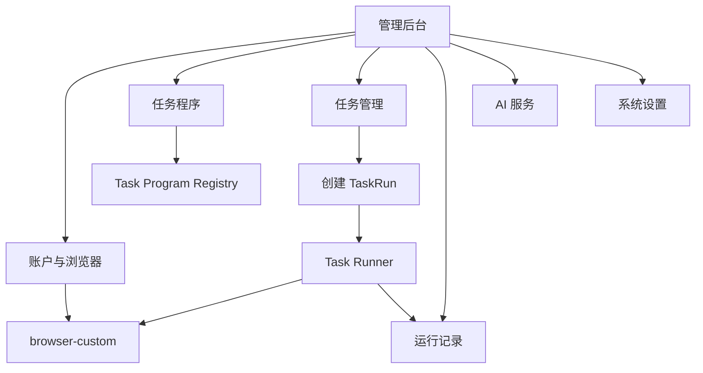

# 管理后台功能与组织设计

> 状态：设计已确认，作为管理后台实现依据
> 日期：2026-08-20
> 关联文档：[脚本式任务系统架构](script-task-system-architecture.md) · [Task Runner 详细处理流程](task-runner-processing-design.md)

## 1. 产品定位

管理后台采用“任务为中心、账户为资源”的组织方式：

```text
检查账户和浏览器
→ 选择任务程序
→ 配置参数和账户
→ 立即运行或设置计划
→ 查看状态、日志和结果
```

后台只提供统一管理入口，不改变模块边界，也不引入可视化工作流、动作组、节点编排或在线脚本编辑器。任务程序定义业务；Runner 管理运行；动作库操作 X 页面；`browser-custom` 管理浏览器。

## 2. 导航与功能关系

```text
管理后台
├── 概览
├── 账户与浏览器
├── 任务管理
├── 运行记录
├── 任务程序
├── AI 服务
└── 系统设置
```

计划放在任务详情，日志放在运行详情。第一版不单独设置工作流、动作组、Checkpoint、调度中心、任务日志或审批菜单。



## 3. 概览

概览只展示需要关注的信息，不承担配置：

- 账户总数、运行中浏览器；
- `running`/`queued` TaskRun；
- 今日成功、失败和 `uncertain` 数量；
- 浏览器任务槽位使用量，例如 `8 / 10`；
- 当前运行列表、最近异常、即将执行的计划。

最近异常重点展示登录失效、挑战/受限页面、浏览器启动、代理/GeoIP 和 `uncertain`。槽位是机器资源控制，不是点赞或回复额度。

## 4. 账户与浏览器

统一页面聚合两类信息，但不合并存储：

| 来源 | 信息 |
|---|---|
| `browser-custom` | browser account ID、`userDataDir`、版本、代理、GeoIP、WebRTC、时区、语言、User-Agent、指纹、插件、浏览器状态 |
| 任务系统 | X 用户名/ID、显示名称、标签、备注、是否可参与任务、最近/当前任务 |

关联方式：X 业务账户保存 `browser_account_id`。代理、指纹和 Profile 始终只由 `browser-custom` 保存。

### 4.1 账户列表

推荐字段：名称、X 用户名、标签、浏览器状态、任务状态、代理地区、时区/语言、浏览器版本、最近任务和操作。

支持批量打开、关闭、重启、运行任务、刷新状态和设置标签。

浏览器状态与任务状态必须分开：

```text
浏览器：stopped | starting | running | orphaned | error
任务：idle | queued | running
```

### 4.2 账户详情

展示：

- 基本业务信息和标签；
- Profile、`userDataDir`、CloakBrowser 版本、插件；
- 代理、GeoIP、WebRTC、时区、语言和指纹摘要；
- 当前、等待和历史 TaskRun；
- 打开、关闭、重启浏览器，以及立即运行任务。

敏感字段仅显示掩码，不返回代理密码、Cookie 或 Token 明文。

### 4.3 关闭运行中浏览器

若账户正在执行任务，应提示关闭可能造成失败或结果不确定，并提供：

- 协作式取消任务；
- 强制关闭浏览器；
- 任务退出后关闭浏览器。

这是运行风险提示，不是业务限制。

## 5. 任务程序

任务程序页面只读展示随代码部署的任务类型，不直接编辑 Python。

程序详情读取 `SPEC` 和 Schema，展示名称、版本、说明、参数、输出和示例。后台根据 Pydantic JSON Schema 生成文本框、数字、下拉、开关、多选、必填项和默认值。

程序更新流程为代码修改、测试、Git 和部署。`x-actions-playwright` 的原子动作不是普通管理员的日常入口；如需排查，未来可增加只读开发者诊断页。

## 6. 任务管理

Task 是可重复运行的配置，至少包含：名称、程序、账户选择、参数、运行方式、启用状态和浏览器结束策略。

### 6.1 任务列表

| 字段 | 说明 |
|---|---|
| 名称 / 程序 / 版本 | 当前配置 |
| 账户范围 | 单账户、多账户或标签 |
| 计划 | 手动、一次性或周期 |
| 状态 | 启用、停用、归档 |
| 上次/下次运行 | 时间和结果 |
| 操作 | 运行、编辑、复制、停用 |

支持按名称、程序、状态、账户或标签过滤。

### 6.2 创建与编辑

使用单页分区表单：

1. 基本信息；
2. 选择已部署任务程序；
3. 根据该程序的 `Params` Schema 生成业务参数；
4. 选择固定账户、多选账户或动态标签；
5. 选择手动、一次性或周期/Cron；
6. 选择 `keep_open` 或 `close`。

固定账户保存当前 ID；动态标签在每次触发时重新解析账户。默认建议 `keep_open`，避免连续任务频繁启停浏览器。

### 6.3 多账户

一次触发为每个账户创建独立 TaskRun：

```text
Trigger
├── account-001 → TaskRun-001
├── account-002 → TaskRun-002
└── account-003 → TaskRun-003
```

各运行独立拥有状态、日志、参数快照、输出、错误和取消；共享 `trigger_id` 便于分组。

### 6.4 任务详情与操作

详情分为配置、最近运行和计划。支持保存、立即运行、编辑、复制、启用、停用和归档。有历史运行的任务优先归档，不物理删除。

## 7. 运行记录

### 7.1 列表与状态

列表字段包括 Run ID、任务、程序与版本、账户、触发方式、状态、创建/开始时间、时长和操作；支持按任务、程序、账户、状态、触发方式和时间过滤。

```text
queued | running | succeeded | failed | uncertain | cancelled
```

`success`、`skipped`、`navigating` 等是原子动作状态，只出现在日志或结果中。

### 7.2 运行详情

展示四类信息：

1. 摘要：TaskRun、任务、程序版本、账户、状态、触发方式、时间、结束策略；
2. 参数快照：本次真正使用的参数；
3. 输出、结构化错误和清理告警；
4. 结构化实时日志。

第一版日志轮询刷新，后续可换 SSE/WebSocket。

### 7.3 运行操作

- `queued`：取消后直接进入 `cancelled`；
- `running`：写入取消请求，等待程序协作式退出；
- 重新运行：复制旧运行的程序、账户和参数快照，创建新 TaskRun，以 `rerun_of` 关联；
- `uncertain`：提供查看浏览器、日志和相关帖子，以及新建重跑；不得自动重放可能已成功的写动作。

## 8. AI 服务与系统设置

### 8.1 AI 服务

模型配置包括 Provider、API 地址、API Key、默认模型、超时和连接测试。密钥加密或交给密钥存储，查询接口不返回明文。

提示词模板可包含模板 ID/名称、系统与用户提示词、变量、默认模型和启用状态。是否调用、使用哪个模板和传入什么内容由任务程序决定。模板很少时可先保存在代码中。

### 8.2 运行设置

包括：浏览器任务并发上限、取消检查间隔、默认任务超时、默认浏览器结束策略、日志保留时间和队列轮询间隔。

不包括点赞/回复额度、每账户写操作次数或强制审批。

### 8.3 浏览器设置与服务状态

统一后台调用 `browser-custom` 管理二进制路径、通道、插件目录、账户基础目录等，不在任务系统复制保存。

服务状态可展示 `browser-custom`、Task Runner、任务程序注册数、AI 配置、槽位和队列长度。

## 9. 与 `browser-custom` 后台的关系

`x_ops` 最终提供统一入口；`browser-custom` 现有页面继续作为独立浏览器管理与诊断工具。

原则：

- 浏览器配置只保存在 `browser-custom`；
- 列表和启停可通过 API 调用；
- Task Runner 获取 Page 使用内部 Python 集成或明确连接协议；
- 不通过普通 JSON HTTP 响应传递 Playwright `Page`。

## 10. 后台 API

第一版可先集中在一个 `api.py`，增长后再按资源拆分。

```text
GET    /api/dashboard

GET    /api/accounts
GET    /api/accounts/{account_id}
POST   /api/accounts
PUT    /api/accounts/{account_id}
POST   /api/accounts/{account_id}/browser/open
POST   /api/accounts/{account_id}/browser/close
POST   /api/accounts/{account_id}/browser/restart
POST   /api/accounts/browser/batch
GET    /api/accounts/browser/status

GET    /api/task-programs
GET    /api/task-programs/{program_name}

GET    /api/tasks
POST   /api/tasks
GET    /api/tasks/{task_id}
PUT    /api/tasks/{task_id}
POST   /api/tasks/{task_id}/run
POST   /api/tasks/{task_id}/clone
POST   /api/tasks/{task_id}/enable
POST   /api/tasks/{task_id}/disable

GET    /api/task-runs
GET    /api/task-runs/{run_id}
GET    /api/task-runs/{run_id}/logs
POST   /api/task-runs/{run_id}/cancel
POST   /api/task-runs/{run_id}/rerun

GET    /api/ai/settings
PUT    /api/ai/settings
POST   /api/ai/test
GET    /api/ai/templates
POST   /api/ai/templates

GET    /api/settings/runtime
PUT    /api/settings/runtime
```

手动、计划和重新运行都只负责创建普通 TaskRun，统一交给同一 Runner 链路；Scheduler 不实现第二套执行逻辑。

## 11. 状态模型

后台同时展示三类独立状态：

| 对象 | 状态 |
|---|---|
| Browser | `stopped`, `starting`, `running`, `orphaned`, `error` |
| Task | `enabled`, `disabled`, `archived` |
| TaskRun | `queued`, `running`, `succeeded`, `failed`, `uncertain`, `cancelled` |

例如 Task 可以启用、浏览器当前停止、最近一次 TaskRun 成功，三者并不冲突。

## 12. 实施范围

第一版形成闭环：

1. 概览；
2. 账户列表、详情和浏览器控制；
3. 任务程序只读目录；
4. 任务创建、编辑、立即运行；
5. 多账户拆分 TaskRun；
6. TaskRun 列表、详情、日志和协作式取消；
7. AI 基础配置；
8. 浏览器任务并发设置。

第二阶段再增加周期计划、动态标签、模板编辑、实时日志推送、批量分组和统计。

当前不实现：可视化工作流、动态节点编排、Workflow Compiler、StepRun/Checkpoint、在线任意代码、原子动作日常编排、业务操作额度、强制审批、`uncertain` 自动重试，以及在任务系统复制浏览器配置。

## 13. 验收原则

1. 管理员能完成账户检查、任务创建、运行和结果查看；
2. 参数表单由程序 Schema 驱动，不为每种任务硬编码；
3. 多账户触发拆成独立 TaskRun；
4. 手动、计划和重跑走同一执行链；
5. Browser、Task、TaskRun 状态互相独立；
6. 日志和错误可追溯到任务、运行、账户和程序版本；
7. 浏览器配置只保存在 `browser-custom`；
8. 后台不参与帖子匹配和动作决策；
9. 第一版不引入工作流运行时或在线脚本系统。
