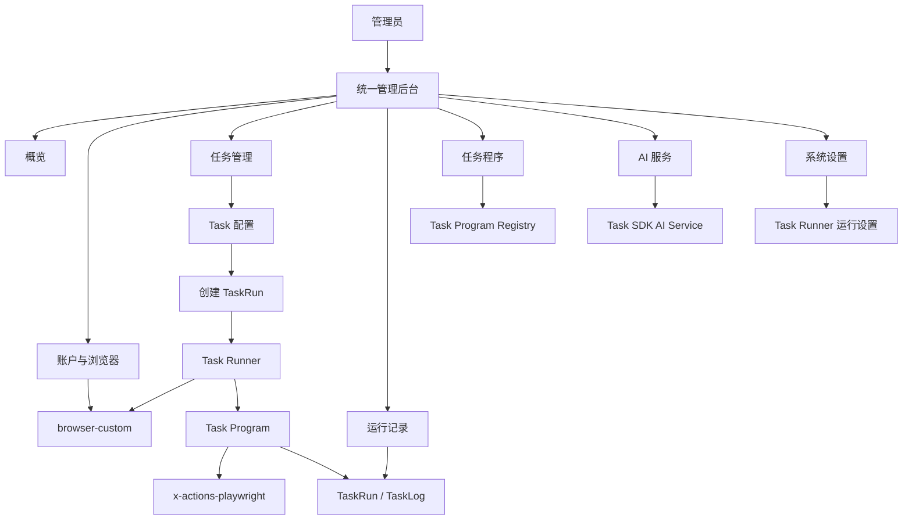
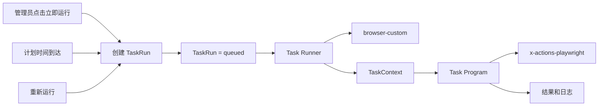

# 管理后台功能与组织设计

> 状态：设计已确认，作为管理后台后续实现依据
> 日期：2026-08-20
> 关联文档：[脚本式任务系统架构](script-task-system-architecture.md)
> 关联文档：[Task Runner 详细处理流程](task-runner-processing-design.md)

## 1. 设计定位

管理后台采用“任务为中心、账户为资源”的组织方式。

管理员日常操作链为：

```text
查看账户和浏览器
  → 选择任务程序
  → 配置任务参数和账户
  → 立即运行或设置计划
  → 查看运行状态、日志和结果
```

管理后台只负责提供统一的管理入口，不改变底层模块边界：

```text
任务程序
  自己编写完整业务逻辑

Task SDK
  只复用当前账户、XActions、AI、日志和取消五项公共服务

Task Runner
  只负责准备、运行和回收运行环境

x-actions-playwright
  只负责 X/Twitter 原子动作

browser-custom
  只负责浏览器账户、Profile、代理、指纹和生命周期
```

管理后台不把每个 X 原子动作作为日常主菜单，也不重新引入可视化工作流、动作组或节点编排。

## 2. 导航结构

推荐菜单：

```text
管理后台
├── 概览
│
├── 账户与浏览器
│   ├── 账户列表
│   └── 账户详情
│
├── 任务管理
│   ├── 任务列表
│   ├── 创建任务
│   └── 任务详情
│
├── 运行记录
│   ├── 全部运行
│   └── 运行详情与日志
│
├── 任务程序
│   ├── 程序目录
│   └── 程序参数说明
│
├── AI 服务
│   ├── 模型配置
│   └── 提示词模板
│
└── 系统设置
    ├── 运行设置
    ├── 浏览器全局设置
    └── 日志设置
```

第一版不单独增加：

- 工作流管理；
- 动作组管理；
- 节点编排；
- Checkpoint 管理；
- 独立调度中心；
- 独立任务日志菜单；
- 点赞、回复等操作额度页面；
- 强制人工审批页面；
- 在线 Python、JavaScript 或 Shell 编辑器。

任务计划放在任务详情中，日志放在运行详情中，避免产生过多零散菜单。

## 3. 总体功能关系



## 4. 概览

概览只展示管理员当前最需要关注的信息，不承担配置功能。

### 4.1 汇总卡片

建议显示：

- 浏览器账户总数；
- 正在运行的浏览器数量；
- 当前正在运行的任务数量；
- 等待运行的任务数量；
- 今日成功任务数量；
- 今日失败任务数量；
- `uncertain` 任务数量；
- 浏览器并发槽位，例如 `8 / 10`。

浏览器并发是机器资源控制，不是点赞、回复等业务操作额度。

概览不显示已经从 `browser-custom` 中删除的内存统计。

### 4.2 当前正在运行

| 字段 | 说明 |
|---|---|
| 任务名称 | 对应 Task 配置 |
| 任务程序 | 例如 `browse_only` |
| 账户 | 当前运行账户 |
| 状态 | `running` |
| 开始时间 | 实际开始时间 |
| 已运行时间 | 动态计算 |
| 操作 | 查看、取消 |

### 4.3 最近异常

重点展示：

- `failed`；
- `uncertain`；
- 浏览器启动失败；
- 登录失效；
- X 挑战页或受限页面；
- 代理、GeoIP 或网络身份解析失败。

`uncertain` 应比普通失败更醒目，因为它表示写动作可能已经成功，也可能没有成功，不能直接自动重试。

### 4.4 即将执行

显示启用了计划的任务：

| 任务名称 | 下次执行时间 | 账户数量 |
|---|---|---:|
| 每日浏览 | 10:00 | 20 |
| 目标用户互动 | 10:30 | 5 |

计划配置仍然属于任务详情，不单独建立调度中心。

## 5. 账户与浏览器

“账户与浏览器”是 `browser-custom` 在统一管理后台中的主要入口。

### 5.1 聚合两类账户信息

页面将浏览器技术信息和 X 业务信息聚合展示，但底层仍然分开保存。

#### 浏览器技术信息

由 `browser-custom` 管理：

- browser-custom 账户 ID；
- `userDataDir`；
- CloakBrowser 版本；
- 代理；
- GeoIP；
- WebRTC IP；
- 时区；
- 语言；
- User-Agent；
- 指纹信息；
- 插件；
- 浏览器状态。

#### X 业务信息

由任务系统管理：

- X 用户名；
- X 用户 ID；
- 账户显示名称；
- 标签；
- 备注；
- 是否允许参与任务；
- 最近执行任务；
- 当前运行任务。

关联关系：

```text
X 业务账户
    browser_account_id
            ↓
browser-custom 账户
    acc / userDataDir / proxy / fingerprint
```

统一页面不代表统一存储。代理、指纹和 Profile 配置仍然只保存在 `browser-custom`。

### 5.2 账户列表

推荐字段：

| 字段 | 说明 |
|---|---|
| 选择框 | 批量操作 |
| 名称 | 管理员设置的显示名称 |
| X 用户名 | 例如 `@example` |
| 标签 | 例如普通号、测试号等 |
| 浏览器状态 | 运行、停止、启动中、孤立、异常 |
| 任务状态 | 空闲、等待、正在运行 |
| 代理地区 | 当前网络身份 |
| 时区/语言 | 当前浏览器身份 |
| 浏览器版本 | CloakBrowser 实际版本 |
| 最近任务 | 最近一次 TaskRun |
| 操作 | 打开、关闭、重启、详情 |

顶部批量操作：

- 批量打开浏览器；
- 批量关闭浏览器；
- 批量重启浏览器；
- 批量运行任务；
- 刷新浏览器状态；
- 设置账户标签。

### 5.3 浏览器状态和任务状态分离

浏览器状态：

```text
stopped
starting
running
orphaned
error
```

账户任务状态：

```text
idle
queued
running
```

例如：

```text
浏览器状态：running
任务状态：idle
```

表示浏览器已经打开，但当前没有任务使用。

```text
浏览器状态：running
任务状态：running
```

表示当前有任务程序正在操作该账户。

### 5.4 账户详情

建议使用四个标签页。

#### 基本信息

- 名称；
- X 用户名；
- X 用户 ID；
- 标签；
- 备注；
- 是否启用。

#### 浏览器与 Profile

- browser-custom 账户 ID；
- `userDataDir`；
- 浏览器路径；
- Stable/Preview 通道；
- 浏览器实际版本；
- 插件目录；
- 打开、关闭、重启；
- 刷新状态。

#### 网络与指纹

- 代理；
- 出口 IP；
- WebRTC IP；
- GeoIP 地区；
- 时区；
- 语言；
- User-Agent；
- 指纹平台；
- 最近一次身份解析结果。

#### 任务记录

- 等待任务；
- 正在运行任务；
- 成功任务；
- 失败任务；
- `uncertain` 任务。

### 5.5 关闭正在执行任务的浏览器

如果账户正在运行任务，关闭前显示技术风险提示：

```text
该浏览器正在执行任务：目标用户互动。
直接关闭可能导致当前动作失败或结果不确定。
```

可以提供三个操作：

- 取消任务：协作式停止，不一定关闭浏览器；
- 强制关闭浏览器：直接结束浏览器；
- 取消任务并关闭：任务协作式退出后再关闭浏览器。

这是运行正确性提示，不是业务操作限制。

## 6. 任务程序

任务程序页面展示已经随代码部署的任务类型。

### 6.1 只读程序目录

| 程序名称 | 版本 | 说明 | 状态 |
|---|---:|---|---|
| `browse_only` | 1.0.0 | 只浏览时间线 | 可用 |
| `like_posts` | 1.0.0 | 匹配并点赞帖子 | 可用 |
| `reply_posts` | 1.1.0 | 固定或 AI 回复 | 可用 |
| `browse_match_engage` | 1.0.0 | 浏览、匹配并互动 | 可用 |

后台不直接编辑任务程序 Python 代码。

程序更新流程：

```text
修改 Python 代码
  → 编写测试
  → Git commit
  → 部署
  → 管理后台读取新版本
```

这样可以避免在线脚本带来的代码安全、版本混乱、依赖不可控和无法测试等问题。

### 6.2 程序详情

展示任务程序的 `SPEC`：

- 程序名称；
- 显示名称；
- 当前版本；
- 功能说明；
- 参数 Schema；
- 输出 Schema；
- 参数示例。

例如：

```json
{
  "feed": "for_you",
  "scroll_count": 20,
  "scroll_interval_seconds": 5,
  "target_user_ids": [],
  "keywords": [],
  "like": true,
  "reply_mode": "ai"
}
```

管理后台根据任务程序的 Pydantic JSON Schema 自动生成：

- 文本框；
- 数字输入；
- 下拉选项；
- 开关；
- 多选；
- 必填项；
- 参数说明和默认值。

### 6.3 原子动作不作为日常入口

在当前架构中，`x-actions-playwright` 是任务程序调用的底层动作库，不需要普通管理员逐个编排动作。

第一版不采用：

```text
原子动作
  → 手工编排
  → 动作组
  → 工作流
```

未来如果需要排查动作，可以增加只读的开发者诊断页面，展示动作 ID、输入输出、幂等性、重试策略和
可能状态，但它不是日常任务配置入口。

## 7. 任务管理

Task 表示一个可以重复运行的配置。

示例：

```text
任务名称：每日浏览 For You
任务程序：browse_only
账户：标签为 normal 的全部账户
参数：
  feed = for_you
  scroll_count = 20
  scroll_interval_seconds = 5
计划：每天 09:00
```

### 7.1 任务列表

| 字段 | 说明 |
|---|---|
| 任务名称 | 管理员设置 |
| 任务程序 | 使用哪个 Python 程序 |
| 程序版本 | 当前部署版本 |
| 账户范围 | 单账户、多账户或标签 |
| 计划 | 手动、一次性或周期 |
| 启用状态 | 启用/停用 |
| 上次运行 | 时间和结果 |
| 下次运行 | 如果有计划 |
| 操作 | 立即运行、编辑、复制、停用 |

列表支持：

- 创建任务；
- 按名称搜索；
- 按任务程序过滤；
- 按启用状态过滤；
- 按账户或标签过滤。

### 7.2 创建任务

建议使用一个页面的分区表单，不需要复杂向导。

#### 基本信息

- 任务名称；
- 描述；
- 是否启用。

#### 选择任务程序

从已部署程序目录中选择。选择后，根据 `Params` Schema 动态生成业务参数表单。

#### 配置业务参数

参数完全由任务程序定义，例如：

```text
时间线：For You
滑动次数：20
每次间隔：5 秒
目标用户 ID：[...]
是否点赞：是
回复方式：AI
```

管理后台只负责收集和校验参数，不解释或执行业务逻辑。

#### 选择账户

支持：

- 单个账户；
- 勾选多个账户；
- 根据标签选择账户。

账户选择可以有两种语义：

```text
固定账户
保存当前选中的账户 ID
```

```text
动态标签
每次触发时重新查找拥有指定标签的账户
```

#### 运行方式

- 仅手动运行；
- 指定时间运行一次；
- 按周期或 Cron 运行。

#### 浏览器结束策略

- 任务结束后保持浏览器打开；
- 任务结束后关闭浏览器。

默认建议保持打开，避免连续任务频繁启动和关闭 CloakBrowser。

### 7.3 多账户任务

一个任务选择多个账户时，为每个账户创建独立 TaskRun：

```text
一个任务触发
    ├── account-001 → TaskRun-001
    ├── account-002 → TaskRun-002
    └── account-003 → TaskRun-003
```

每个账户独立拥有：

- 运行状态；
- 日志；
- 参数快照；
- 输出；
- 错误；
- 取消状态。

同一次批量触发产生的 TaskRun 可以共享 `trigger_id`，方便管理后台分组展示，不需要增加复杂工作流表。

### 7.4 任务详情

建议使用三个标签页。

#### 配置

- 任务程序；
- 账户选择；
- 业务参数；
- 计划；
- 浏览器结束策略。

#### 最近运行

显示该任务产生的 TaskRun。

#### 计划

- 是否启用；
- 执行规则；
- 下次执行时间；
- 最近一次调度时间。

### 7.5 任务操作

- 保存；
- 立即运行；
- 编辑；
- 复制；
- 启用；
- 停用；
- 归档。

已经存在历史 TaskRun 的任务建议归档，而不是物理删除，以保留历史关联。

## 8. 运行记录

运行记录是判断任务实际执行情况的主要页面。

### 8.1 运行列表

| 字段 | 说明 |
|---|---|
| Run ID | 本次运行 ID |
| 任务 | 来源 Task |
| 任务程序 | 程序名称和版本 |
| 账户 | 当前账户 |
| 触发方式 | 手动、计划、重新运行 |
| 状态 | `queued`、`running` 等 |
| 创建时间 | 进入队列时间 |
| 开始时间 | 实际开始时间 |
| 运行时长 | 动态或最终时长 |
| 操作 | 查看、取消、重新运行 |

筛选条件：

- 任务；
- 任务程序；
- 账户；
- 状态；
- 触发方式；
- 时间范围。

### 8.2 TaskRun 状态

```text
queued
running
succeeded
failed
uncertain
cancelled
```

| 状态 | 含义 |
|---|---|
| `queued` | 等待账户锁或浏览器并发槽位 |
| `running` | 任务程序正在执行 |
| `succeeded` | 任务程序正常结束 |
| `failed` | 发生确定性失败 |
| `uncertain` | 写动作已触发，但结果无法确认 |
| `cancelled` | 协作式取消完成 |

`success`、`skipped`、`navigating` 等属于原子动作状态，不直接作为 TaskRun 顶层状态，可以写入任务日志。

### 8.3 运行详情

建议分为四个区域。

#### 运行摘要

- TaskRun ID；
- 任务名称；
- 程序名称和版本；
- 账户；
- 状态；
- 触发方式；
- 开始和结束时间；
- 浏览器结束策略。

#### 参数快照

显示本次运行真正使用的参数：

```json
{
  "feed": "for_you",
  "scroll_count": 20,
  "target_user_ids": ["123", "456"]
}
```

任务配置后续被修改时，历史 TaskRun 仍然保留原参数。

#### 输出和错误

成功输出示例：

```json
{
  "posts_seen": 52,
  "matched": 4,
  "liked": 3,
  "replied": 1
}
```

错误示例：

```json
{
  "code": "LOGIN_REQUIRED",
  "message": "当前账户需要重新登录",
  "source": "x-actions-playwright"
}
```

#### 实时日志

```text
10:00:01  开始任务
10:00:05  打开 For You
10:00:12  收集到 8 条帖子
10:00:15  匹配到目标作者
10:00:17  点赞成功
10:00:24  收到取消请求
10:00:25  任务已取消
```

第一版可以通过轮询刷新，后续再改成 SSE 或 WebSocket。

### 8.4 运行操作

#### 取消

只对 `queued` 或 `running` 显示：

- `queued`：直接标记为 `cancelled`；
- `running`：写入 `cancel_requested`，等待任务程序协作式退出。

#### 重新运行

重新运行不是恢复旧协程，而是：

```text
复制旧 TaskRun 的程序、账户和参数快照
  → 创建新的 TaskRun
```

新旧运行可以通过 `rerun_of` 关联。

#### uncertain 处理

提供：

- 查看账户浏览器；
- 查看详细日志；
- 打开相关帖子；
- 使用原参数创建新的 TaskRun。

不自动重新执行可能已经成功的点赞或回复。

## 9. AI 服务

只有任务程序需要生成内容时才使用 AI 服务。

### 9.1 模型配置

- AI Provider；
- API 地址；
- API Key；
- 默认模型；
- 请求超时；
- 测试连接。

API Key 应通过密钥存储或加密保存，查询接口不返回明文，只显示是否已经配置。

### 9.2 提示词模板

例如：

```text
reply_to_post
quote_post
summarize_post
```

模板字段：

- 模板名称；
- 模板 ID；
- 系统提示词；
- 用户提示词；
- 可用变量；
- 默认模型；
- 启用状态。

任务程序调用：

```python
reply = await context.ai.generate(
    template="reply_to_post",
    variables={"post_text": post.text},
)
```

是否调用 AI、使用哪个模板、传入哪条帖子仍然由任务程序决定。

第一版如果模板数量很少，也可以先放在代码中；需要频繁调整时再开放后台编辑。

## 10. 系统设置

### 10.1 运行设置

建议包括：

- 最大同时运行浏览器数量；
- 取消状态检查间隔；
- 默认任务超时；
- 默认浏览器结束策略；
- 任务日志保留时间；
- 运行队列轮询间隔。

不包括：

- 每日点赞额度；
- 每日回复额度；
- 每账户写操作次数；
- 强制人工审批。

### 10.2 浏览器全局设置

这些配置实际由 `browser-custom` 保存，统一管理后台调用其 API：

- CloakBrowser 二进制路径；
- Stable/Preview 通道；
- 全局插件目录；
- 账户基础目录；
- 其他 browser-custom 全局设置。

任务系统数据库不复制保存这些配置。

### 10.3 服务状态

可以显示：

- `browser-custom` 是否可用；
- Task Runner 是否运行；
- 已注册任务程序数量；
- AI 服务是否配置；
- 当前浏览器并发槽位；
- 当前任务队列长度。

## 11. 与 browser-custom 现有后台的关系

推荐最终由 `x_ops` 提供统一管理后台：

```text
x_ops 管理后台
    ├── 调用 browser-custom 管理账户和浏览器
    ├── 展示任务程序
    ├── 创建任务
    ├── 查看 TaskRun
    └── 配置 AI 和运行环境
```

`browser-custom` 当前 Web 页面继续保留，但定位为独立浏览器管理和诊断页面。

原则：

- 浏览器配置仍然只保存在 `browser-custom`；
- 统一后台通过 API 或内部接口读取；
- 不在两个系统分别保存代理、指纹和 Profile 配置；
- 浏览器列表和启停操作可以使用 browser-custom HTTP API；
- Task Runner 获取 Playwright `Page` 时使用内部 Python 集成或明确的浏览器连接机制；
- 不尝试通过普通 JSON HTTP 响应传递 `Page` 对象。

## 12. 后台 API 组织

任务系统未来位于 `apps/x-ops/`。以下目录树展示其中的
`apps/x-ops/src/x_ops/` Python 包及 Web 资源结构：

```text
x_ops/
├── api/
│   ├── dashboard.py
│   ├── accounts.py
│   ├── task_programs.py
│   ├── tasks.py
│   ├── task_runs.py
│   ├── ai.py
│   └── settings.py
│
└── web/
    ├── pages/
    │   ├── dashboard/
    │   ├── accounts/
    │   ├── tasks/
    │   ├── task-runs/
    │   ├── task-programs/
    │   ├── ai/
    │   └── settings/
    └── components/
```

第一版 API：

```text
GET    /api/dashboard

GET    /api/accounts
GET    /api/accounts/{account_id}
POST   /api/accounts
PUT    /api/accounts/{account_id}

POST   /api/accounts/{account_id}/browser/open
POST   /api/accounts/{account_id}/browser/close
POST   /api/accounts/{account_id}/browser/restart
POST   /api/accounts/browser/batch
GET    /api/accounts/browser/status

GET    /api/task-programs
GET    /api/task-programs/{program_name}

GET    /api/tasks
POST   /api/tasks
GET    /api/tasks/{task_id}
PUT    /api/tasks/{task_id}
POST   /api/tasks/{task_id}/run
POST   /api/tasks/{task_id}/clone
POST   /api/tasks/{task_id}/enable
POST   /api/tasks/{task_id}/disable

GET    /api/task-runs
GET    /api/task-runs/{run_id}
GET    /api/task-runs/{run_id}/logs
POST   /api/task-runs/{run_id}/cancel
POST   /api/task-runs/{run_id}/rerun

GET    /api/ai/settings
PUT    /api/ai/settings
POST   /api/ai/test
GET    /api/ai/templates
POST   /api/ai/templates

GET    /api/settings/runtime
PUT    /api/settings/runtime
```

第一版实现时可以先放在一个 `api.py` 中；端点数量增长后再按以上目录拆分，不需要为了目录完整而预先创建空模块。

## 13. 后台功能与架构模块映射

| 管理后台功能 | 实际负责模块 |
|---|---|
| 浏览器打开、关闭、重启 | `browser-custom` |
| 代理和指纹配置 | `browser-custom` |
| 浏览器状态刷新 | `browser-custom` |
| 展示任务程序 | Task Program Registry |
| 动态生成参数表单 | Task Program `Params` Schema |
| 保存 Task 配置 | 任务管理服务 |
| 创建 TaskRun | 任务管理服务 |
| 准备 Page 和运行环境 | Task Runner |
| 执行浏览、点赞、回复 | `x-actions-playwright` |
| AI 生成内容 | Task SDK 的 AI 服务 |
| 写任务日志 | Task SDK 的 Logger |
| 取消运行 | Task SDK + Task Runner |
| 匹配作者、帖子和内容 | 具体任务程序 |
| 保存成功、失败状态 | Task Runner |
| 计划触发 | Scheduler 创建普通 TaskRun |

## 14. 统一任务触发流程

手动运行、计划运行和重新运行必须走同一条执行链：



Scheduler 只在时间到达时创建普通 TaskRun，不实现第二套任务执行逻辑。

一次运行的详细过程：

```text
后台创建 TaskRun
  → TaskRun 进入 queued
  → Task Runner 获取账户锁
  → Task Runner 获取浏览器并发槽位
  → browser-custom 获取或启动账户浏览器
  → Task Runner 取得当前账户 Page
  → 创建绑定 Page 的 XActions
  → 创建只有五项能力的 TaskContext
  → 调用 TaskProgram.run(context, params)
  → 任务程序执行完整业务逻辑
  → 保存结果和任务日志
  → 释放浏览器使用权、并发槽位和账户锁
```

## 15. 管理后台状态模型

后台同时展示三类状态，必须分开处理。

### 15.1 浏览器状态

来源于 `browser-custom`：

```text
stopped
starting
running
orphaned
error
```

### 15.2 Task 配置状态

```text
enabled
disabled
archived
```

### 15.3 TaskRun 状态

```text
queued
running
succeeded
failed
uncertain
cancelled
```

三个状态不能共用一个字段。例如 Task 可以是 `enabled`，浏览器是 `stopped`，同时其最近一次 TaskRun 是
`succeeded`，三者并不冲突。

## 16. 第一版实现范围

第一版完成以下功能即可形成闭环：

1. 概览；
2. 账户与浏览器列表；
3. 账户详情和浏览器控制；
4. 任务程序只读列表；
5. 任务创建、编辑和立即运行；
6. 多账户创建独立 TaskRun；
7. TaskRun 列表；
8. TaskRun 详情和日志；
9. 协作式取消；
10. AI 基础配置；
11. 最大浏览器并发设置。

第二阶段再增加：

- 周期计划；
- 标签动态选择账户；
- AI 提示词后台编辑；
- SSE 或 WebSocket 实时日志；
- 批量运行分组展示；
- 更完整的运行统计。

## 17. 当前明确不实现

- 可视化工作流运行时；
- 动作组和动态节点编排；
- 通用 Workflow Compiler；
- StepRun、Checkpoint 和步骤恢复；
- 在线编辑和执行任意 Python、JavaScript 或 Shell；
- 原子动作日常编排后台；
- 点赞、回复等业务操作额度；
- 强制人工审批；
- 对 `uncertain` 写动作盲目自动重试；
- 在任务系统中复制保存 browser-custom 配置。

## 18. 管理后台验收原则

1. 管理员可以从账户检查一路完成任务创建、运行和结果查看；
2. 任务程序参数表单由程序 Schema 驱动，不在前端硬编码每种任务；
3. 一个多账户任务为每个账户创建独立 TaskRun；
4. 手动、计划和重新运行使用同一执行链；
5. 浏览器状态、Task 状态和 TaskRun 状态互相独立；
6. 日志和错误可以明确追溯到任务、运行、账户和程序版本；
7. 浏览器配置只保存在 `browser-custom`；
8. 管理后台不参与具体帖子匹配和动作决策；
9. Task Runner 不包含点赞、回复或浏览业务；
10. 第一版不引入工作流运行时和在线脚本系统。
