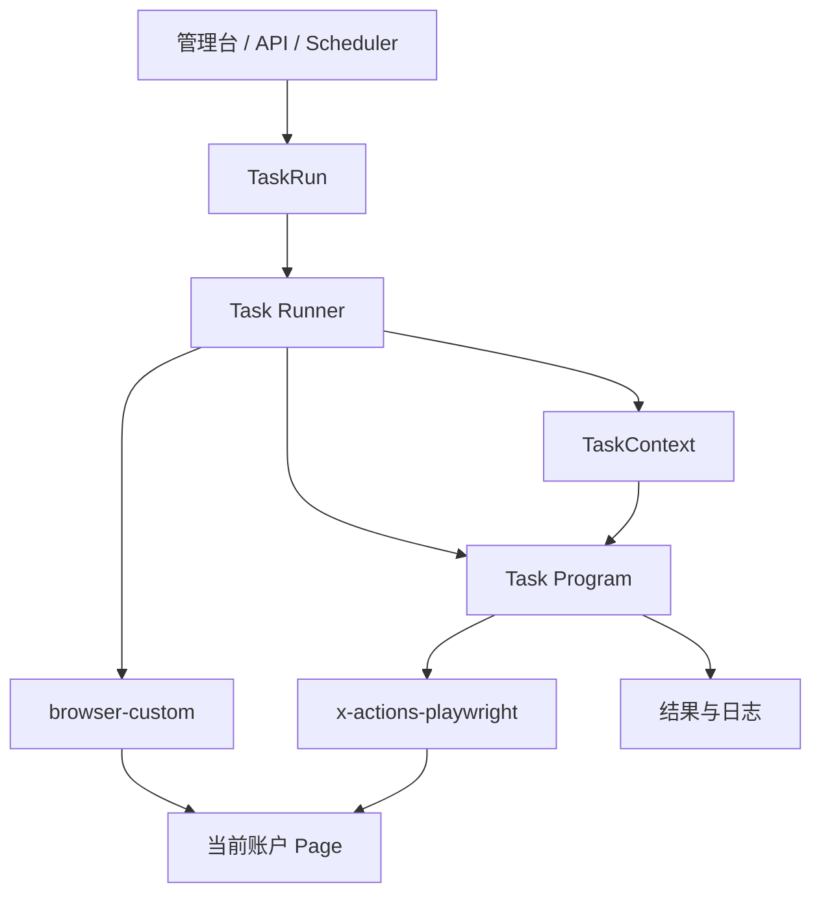
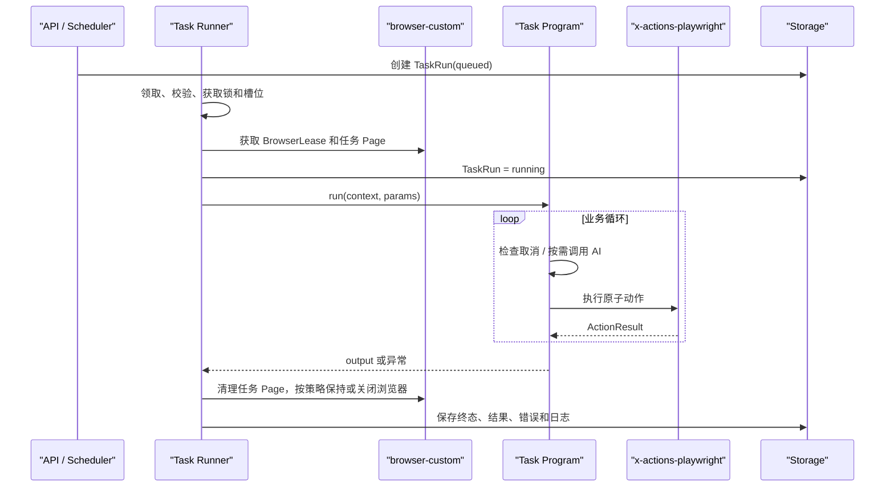

# 脚本式任务系统架构设计

> 状态：架构已确认，作为当前实现依据
> 日期：2026-08-20
> 适用范围：基于 CloakBrowser、Playwright 和 X/Twitter 原子动作的多账户任务系统
> 关联文档：[Task Runner 详细处理流程](task-runner-processing-design.md) · [管理后台功能与组织设计](admin-console-design.md) · [冻结的可视化工作流方案](visual-workflow-engine-design.md)

## 1. 设计结论

当前系统采用“每种任务一个 Python 任务程序”的方案，不实现通用可视化工作流运行时。

| 层 | 唯一职责 |
|---|---|
| Task Program | 定义完整业务逻辑 |
| Task SDK | 向任务程序提供五项公共能力 |
| Task Runner | 准备、运行和回收一次 TaskRun 的环境 |
| `x-actions-playwright` | 实现 X/Twitter 原子动作 |
| `browser-custom` | 管理浏览器账户、Profile 和生命周期 |

判断原则：业务决策进任务程序；公共运行能力进 Task SDK；生命周期进 Runner；X 页面操作进动作库；浏览器配置和进程管理进 `browser-custom`。



依赖必须单向。禁止以下情况：

- `browser-custom` 理解 X 业务或任务程序；
- `x-actions-playwright` 管理调度、账户或 TaskRun；
- Task SDK 知道具体任务程序；
- Task Runner 包含浏览、匹配、点赞、回复等业务规则；
- 任务程序自行启动浏览器、实现 Locator 或更新 TaskRun 状态。

## 2. 建议代码组织

任务系统位于 `apps/x-ops/src/x_ops/`：

```text
x_ops/
├── api.py
├── models.py
├── storage.py
├── scheduler.py
├── task_sdk/
│   ├── context.py
│   ├── account.py
│   ├── ai.py
│   ├── logging.py
│   ├── cancellation.py
│   └── errors.py
├── task_programs/
│   ├── registry.py
│   ├── browse_only.py
│   ├── like_posts.py
│   └── browse_match_engage.py
├── runner/
│   ├── runner.py
│   ├── locks.py
│   └── concurrency.py
└── integrations/
    ├── browser_custom.py
    └── x_actions.py
```

第一版不必一次创建所有模块；目录只表达边界。

## 3. Task Program：完整业务逻辑

任务程序是一种可复用任务类型，例如：

- `browse_only`：浏览指定时间线；
- `like_posts`：匹配并点赞帖子；
- `reply_posts`：使用固定内容或 AI 回复；
- `browse_match_engage`：浏览、匹配并组合互动。

它负责起始页面、滚动和循环、匹配规则、动作选择与顺序、AI 使用方式、单个动作异常策略以及最终统计。系统不额外添加点赞、回复等业务额度。

### 3.1 最小契约

每个程序导出：

```python
SPEC
Params
async def run(context, params)
```

```python
from typing import Literal
from pydantic import BaseModel, Field

SPEC = {
    "name": "browse_only",
    "version": "1.0.0",
    "title": "浏览时间线",
}

class Params(BaseModel):
    feed: Literal["for_you", "following"] = "for_you"
    scroll_count: int = Field(ge=1)
    scroll_interval_seconds: float = Field(ge=0)

async def run(context, params: Params) -> dict:
    await context.actions.timeline.open(feed=params.feed)
    for index in range(params.scroll_count):
        await context.cancellation.raise_if_cancelled()
        await context.actions.timeline.scroll()
        context.logger.info("完成滚动", index=index + 1)
        await context.cancellation.sleep(params.scroll_interval_seconds)
    return {"scrollsCompleted": params.scroll_count}
```

`Params` 由程序自行定义；Task Runner 只调用其模型校验，不解释字段含义。

### 3.2 禁止承担的职责

任务程序不得：

- 创建或关闭 Playwright/CloakBrowser；
- 配置 `userDataDir`、代理、指纹、时区、语言或插件；
- 实现 X Locator；
- 直接读写 TaskRun 状态；
- 申请账户锁、并发槽位或调度其他账户。

## 4. Task SDK：五项公共能力

```python
@dataclass(frozen=True)
class TaskContext:
    account: AccountContext
    actions: BoundXActions
    ai: AIService
    logger: TaskLogger
    cancellation: CancellationToken
```

### 4.1 `account`

当前账户的只读业务快照，可包含 `account_id`、名称、用户名、标签和非敏感 metadata。不得暴露代理密码、完整浏览器配置，也不得枚举或调度其他账户。

### 4.2 `actions`

绑定当前 TaskRun 专用 `Page` 的 XActions：

```python
await context.actions.timeline.collect(...)
await context.actions.interaction.like(...)
await context.actions.publish.reply(...)
```

若动作库仍要求显式传 `Page`，集成层用薄包装器补入。程序不能切换到其他账户的 Page。

### 4.3 `ai`

统一处理模板渲染、模型调用、超时和错误转换。是否调用、何时调用、使用哪条帖子仍由任务程序决定。

### 4.4 `logger`

写结构化任务日志，并自动补充 `task_id`、`task_run_id`、程序、账户、时间和级别。日志用于观察与排错，不演变为 StepRun 或 Checkpoint 系统。

### 4.5 `cancellation`

采用协作式取消：

```python
await context.cancellation.raise_if_cancelled()
await context.cancellation.sleep(seconds)
```

程序应在循环、动作边界和长等待中检查取消。已触发的写动作应先完成结果确认，再在下一个检查点退出，以免制造更多 `uncertain`。

### 4.6 不属于 SDK 的内容

调度、多账户分配、账户锁、并发槽位、浏览器生命周期、TaskRun 持久化、数据库通用访问、业务匹配策略、工作流节点和通用重试编排都不进入 Task SDK。可复用的纯函数放普通工具模块。

## 5. Task Runner：运行容器

Runner 的核心调用只有：

```python
output = await program.run(context, params)
```

它负责领取 TaskRun、校验程序和参数、读取账户、取得账户锁与浏览器槽位、获取 BrowserLease/Page、构造 TaskContext、映射最终结果并清理资源。

同一账户同一时间只运行一个 TaskRun；不同账户可以并行。浏览器并发槽位保护机器资源，不是业务操作额度。

顶层状态统一为：

```text
queued → running → succeeded | failed | uncertain | cancelled
```

`uncertain` 表示写动作已触发但无法确认结果，不得盲目自动重试。详细领取、取消、清理和异常流程见 [Task Runner 详细处理流程](task-runner-processing-design.md)。

## 6. 底层模块边界

### 6.1 `x-actions-playwright`

负责 Locator、点击/输入/导航/等待、页面对象识别、前后置状态校验和结构化动作结果。典型动作包括打开/收集时间线、滚动、打开帖子、点赞、回复、引用、转发、收藏、关注和发帖。

约定：

- 已处于目标幂等状态时返回 `skipped`；
- 写动作已触发但无法确认时返回 `uncertain`；
- 登录失效、挑战页、受限账户等由动作层识别；
- 不负责浏览器生命周期、账户选择、调度、业务匹配、AI 或 TaskRun。

### 6.2 `browser-custom`

负责每账户独立 persistent context、`userDataDir`、CloakBrowser 版本、代理、GeoIP、WebRTC、时区、语言、指纹、插件、启停重启、真实进程状态，以及提供 BrowserContext/Page。

Playwright `Page` 是进程内对象，不能放入普通 JSON HTTP 响应。第一版应让 Runner 与 Session Registry 位于同一 Python Worker，通过内部接口取得 Page；未来拆进程时使用明确的 Playwright 连接协议。

## 7. 一次运行的主链路



多账户任务在创建阶段拆成多个 TaskRun，每个 TaskRun 只对应一个账户，并可用 `trigger_id` 分组。

## 8. 错误与重试原则

| 来源 | 识别模块 | 示例 |
|---|---|---|
| 浏览器环境 | `browser-custom` | 启动、代理、Context 失败 |
| X 页面动作 | `x-actions-playwright` | 登录失效、目标不存在、结果不确定 |
| AI | Task SDK AI | 模型超时、模板错误 |
| 业务逻辑 | Task Program | 参数组合或业务条件不支持 |
| 生命周期 | Task Runner | 程序不存在、账户无效、资源准备失败 |

处理规则：

- 单个动作失败后继续、跳过或终止，由任务程序决定；
- 未处理异常由 Runner 映射为顶层 `failed`；
- `uncertain` 必须显式传播或记录，不能盲目重试；
- Runner 不自动从头重跑整个任务；重跑创建新的 TaskRun；
- 无论结果如何，Runner 都必须清理资源。

## 9. 最小持久化

### `tasks`

保存可重复运行的配置：名称、程序、账户选择、参数、启用状态、可选计划和时间戳。

### `task_runs`

至少保存：

```text
id, task_id, trigger_id, rerun_of
program_name, program_version
account_id, params_snapshot_json
status, output_json, error_json
cancel_requested_at, started_at, finished_at
browser_end_policy
```

参数快照和实际程序版本必须固化，避免任务配置或代码更新后无法解释历史运行。

### `task_logs`

保存 `task_run_id`、账户、级别、消息、结构化字段和时间。

当前不增加 `step_runs`、`step_attempts`、`checkpoints`、`iteration_runs` 或工作流版本表。

## 10. 版本与测试

- 每个程序通过 `SPEC.version` 声明版本；
- TaskRun 保存实际执行版本和参数快照；
- 业务含义或参数结构变化时提升版本；
- Python 源码继续由 Git、测试和部署管理，不支持后台动态上传任意脚本。

测试边界：

- Task Program：用假的 TaskContext 测试匹配、循环、动作顺序、统计和取消；
- Task SDK：测试只读账户、日志关联、AI 错误和可取消等待；
- Task Runner：测试领取、互斥、并发、状态映射和全部清理路径；
- 动作库与浏览器：分别测试 Locator/后置条件和 Profile/网络身份/生命周期；
- 集成测试：验证 Runner 能把正确 Page 绑定到 XActions。

## 11. 当前明确不实现

- 可视化工作流运行时、动作组和动态节点编排；
- Workflow Compiler、StepRun、Checkpoint 和步骤恢复；
- 在线编辑或执行任意 Python、JavaScript、Shell；
- 通用脚本沙箱；
- 点赞、回复等业务操作额度或强制人工审批；
- 对 `uncertain` 写动作盲目自动重试。

可视化工作流文档仅作为未来设计资料，不是当前实现依赖。

## 12. 架构验收

新增功能应能明确回答：

1. 是否决定“做什么业务”？放 Task Program；
2. 是否是五项公共运行能力之一？放 Task SDK；
3. 是否准备或释放一次运行资源？放 Task Runner；
4. 是否操作 X 页面并验证结果？放 `x-actions-playwright`；
5. 是否管理 CloakBrowser、Profile、代理、指纹或生命周期？放 `browser-custom`。

若同时命中多层，应拆分接口与实现，而不是让单个模块跨层接管。
