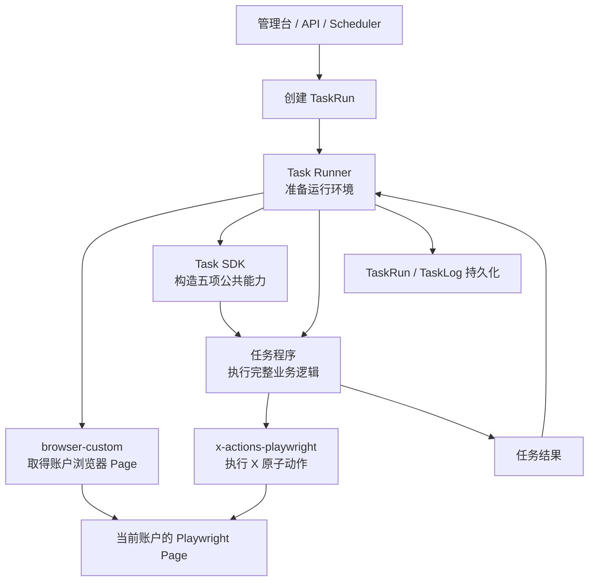
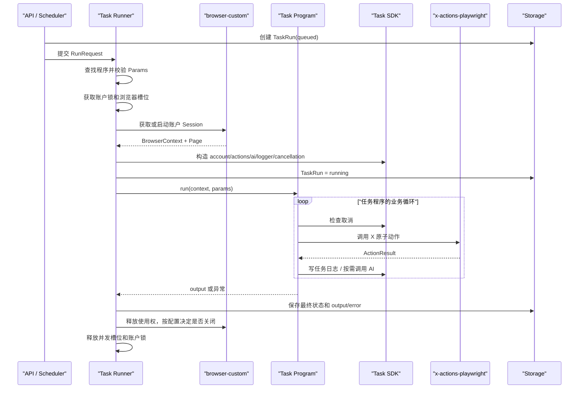
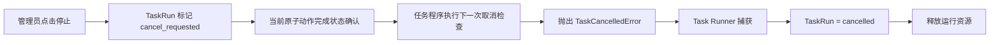

# 脚本式任务系统架构设计

> 状态：架构已确认，作为后续实现依据
> 日期：2026-08-20
> 适用范围：基于 CloakBrowser、Playwright 和 X/Twitter 原子动作的多账户任务系统
> 关联文档：[管理后台功能与组织设计](admin-console-design.md)
> 关联文档：[Task Runner 详细处理流程](task-runner-processing-design.md)

## 1. 设计结论

系统采用“每种任务一个 Python 任务程序”的方案，不实现通用可视化工作流运行时。

已经确认的五层结构如下：

1. **任务程序（Task Program）**：自己编写完整业务逻辑；
2. **Task SDK**：只复用任务程序需要的五项公共服务；
3. **Task Runner**：只负责准备、运行和回收运行环境；
4. **x-actions-playwright**：只负责 X/Twitter 原子动作；
5. **browser-custom**：只负责浏览器账户、Profile 和浏览器生命周期。

核心原则：

```text
业务逻辑只进入任务程序
公共服务只进入 Task SDK
运行生命周期只进入 Task Runner
X 页面操作只进入 x-actions-playwright
浏览器管理只进入 browser-custom
```

任何新功能都应先判断属于哪一层，避免跨层复制逻辑或让底层模块逐渐理解业务。

## 2. 总体结构



依赖方向必须保持单向：

```text
任务程序
  └── Task SDK
        ├── x-actions-playwright
        └── AI、日志、取消等公共接口

Task Runner
  ├── 任务程序注册表
  ├── Task SDK
  ├── browser-custom
  └── 运行状态存储

x-actions-playwright
  └── Playwright Page

browser-custom
  └── CloakBrowser + Playwright persistent context
```

禁止反向依赖：

- `browser-custom` 不得导入任务程序或 X 业务逻辑；
- `x-actions-playwright` 不得导入 Task Runner、调度器或账户业务；
- Task SDK 不得知道具体任务程序；
- Task Runner 不得包含浏览、匹配、点赞、回复等业务规则；
- 任务程序不得自行启动 CloakBrowser 或实现底层 X Locator。

## 3. 建议目录

任务系统未来作为独立应用放在 `apps/x-ops/`。以下目录树展示其中的
`apps/x-ops/src/x_ops/` Python 包内部结构：

```text
x_ops/
├── api.py                         # 创建、查询、取消任务
├── models.py                      # Task、TaskRun 等公共数据模型
├── storage.py                     # 最小持久化接口
│
├── task_sdk/
│   ├── __init__.py
│   ├── context.py                 # TaskContext，组合五项能力
│   ├── account.py                 # 只读当前账户信息
│   ├── ai.py                      # AI 生成接口
│   ├── logging.py                 # 结构化任务日志
│   ├── cancellation.py            # 协作式取消
│   └── errors.py                  # SDK 公共异常
│
├── task_programs/
│   ├── __init__.py
│   ├── registry.py                # 任务程序注册表
│   ├── browse_only.py             # 纯浏览任务
│   ├── like_posts.py              # 点赞任务
│   ├── reply_posts.py             # 回复任务
│   └── browse_match_engage.py     # 浏览、匹配并互动
│
├── runner/
│   ├── __init__.py
│   ├── runner.py                  # 通用运行入口
│   ├── locks.py                   # 同账户互斥
│   └── concurrency.py             # 浏览器并发槽位
│
├── integrations/
│   ├── browser_custom.py          # browser-custom 调用适配器
│   └── x_actions.py               # 将当前 Page 绑定为 XActions
│
└── scheduler.py                   # 可选：按计划创建 TaskRun
```

这只是代码组织建议，不代表需要一次实现所有文件。第一版可以从一个 `TaskRunner`、一个
`TaskContext`、一个注册表和少量任务程序开始。

## 4. 任务程序：完整业务逻辑

### 4.1 定位

一个任务程序表示一种可复用的业务任务类型，而不是某一次具体运行。

例如：

- `browse_only`：只浏览 For You 或 Following；
- `like_posts`：寻找符合条件的帖子并点赞；
- `reply_posts`：寻找目标帖子并使用固定内容或 AI 内容回复；
- `browse_match_engage`：浏览、匹配作者或内容，再组合执行若干互动动作。

创建任务时只是为任务程序提供账户和参数：

```text
任务程序：browse_match_engage
账户：account-001
参数：feed、滚动次数、目标作者、关键词、回复模式等
```

同一个任务程序可以被不同账户、不同参数重复运行。

### 4.2 任务程序负责什么

任务程序负责完整业务过程，包括：

- 从哪个页面开始；
- 浏览 For You 还是 Following；
- 滚动多少次、间隔多久；
- 如何匹配作者 ID、帖子 ID、关键词或其他内容；
- 匹配后执行点赞、回复、引用、关注中的哪些动作；
- 多个动作的先后顺序；
- 使用固定回复还是调用 AI；
- 如何处理某个动作的 `skipped`、`failed` 或 `uncertain`；
- 最终返回哪些业务统计和结果。

系统不额外设计点赞、回复等业务额度。任务程序调用了相应原子动作，执行层就按程序逻辑执行。

### 4.3 最小程序契约

每个任务程序只需要导出三项内容：

```python
SPEC
Params
async def run(context, params)
```

示例：

```python
from typing import Literal

from pydantic import BaseModel, Field


SPEC = {
    "name": "browse_only",
    "version": "1.0.0",
    "title": "浏览时间线",
}


class Params(BaseModel):
    feed: Literal["for_you", "following"] = "for_you"
    scroll_count: int = Field(ge=1)
    scroll_interval_seconds: float = Field(ge=0)


async def run(context, params: Params) -> dict:
    context.logger.info("任务开始", feed=params.feed)

    await context.actions.timeline.open(feed=params.feed)

    for index in range(params.scroll_count):
        await context.cancellation.raise_if_cancelled()
        await context.actions.timeline.scroll()
        context.logger.info("完成滚动", index=index + 1)
        await context.cancellation.sleep(params.scroll_interval_seconds)

    return {"scrollsCompleted": params.scroll_count}
```

`Params` 属于任务程序本身，不属于 Task SDK。不同任务可以自由定义自己的参数结构。

### 4.4 任务程序不负责什么

任务程序不负责：

- 创建或关闭 Playwright；
- 启动、关闭、重启 CloakBrowser；
- 读取或修改 `userDataDir`；
- 配置代理、指纹、时区、语言或插件；
- 自行寻找浏览器进程；
- 实现 X 页面的 Locator；
- 直接连接数据库更新 TaskRun 状态；
- 自行申请账户锁或浏览器并发槽位。

## 5. Task SDK：只复用五项公共服务

### 5.1 TaskContext

Task SDK 的主要对象是 `TaskContext`：

```python
from dataclasses import dataclass


@dataclass(frozen=True)
class TaskContext:
    account: AccountContext
    actions: BoundXActions
    ai: AIService
    logger: TaskLogger
    cancellation: CancellationToken
```

Task SDK 严格只向任务程序提供以下五项能力。

### 5.2 当前账户信息

```python
context.account
```

提供当前任务账户的只读业务信息，例如：

```python
@dataclass(frozen=True)
class AccountContext:
    account_id: str
    name: str
    username: str | None
    tags: tuple[str, ...]
    metadata: Mapping[str, object]
```

这里只提供当前账户，不允许任务程序通过 SDK 枚举、修改或调度其他账户。

代理密码、完整浏览器配置和其他敏感信息不应进入 `AccountContext`。

### 5.3 绑定当前 Page 的 XActions

```python
context.actions
```

它只操作当前任务账户对应的 Playwright `Page`。任务程序不需要反复传入 `page`：

```python
await context.actions.timeline.collect(...)
await context.actions.interaction.like(...)
await context.actions.publish.reply(...)
```

如果 `x-actions-playwright` 当前公开接口仍要求每次传入 `Page`，集成层可以使用一个很薄的
`BoundXActions` 包装器自动补入当前 Page。任务程序不应直接持有或切换其他账户的 Page。

### 5.4 AI 生成接口

```python
context.ai
```

提供统一的文本生成能力：

```python
reply = await context.ai.generate(
    template="reply_to_post",
    variables={
        "post_text": post.text,
        "tone": params.reply_tone,
    },
)
```

AI 服务负责模型调用、模板渲染、超时和错误转换，但不决定何时回复、回复哪条帖子或是否执行回复。
这些决策仍然属于任务程序。

### 5.5 任务日志

```python
context.logger
```

提供结构化日志：

```python
context.logger.info(
    "发现目标帖子",
    post_id=post.id,
    author_id=post.author_id,
)
```

日志器自动补充：

- `task_id`；
- `task_run_id`；
- `program_name`；
- `account_id`；
- 时间和日志级别。

任务日志用于管理台查看和错误排查，不扩展为通用 StepRun、Checkpoint 或工作流节点系统。

### 5.6 取消检查

```python
context.cancellation
```

取消采用协作式取消：

```python
class CancellationToken:
    async def raise_if_cancelled(self) -> None:
        ...

    async def sleep(self, seconds: float) -> None:
        ...
```

任务程序在动作边界和循环内主动检查：

```python
for post in posts:
    await context.cancellation.raise_if_cancelled()
    await context.actions.interaction.like(tweet_id=post.id)
```

`sleep()` 是取消能力的一部分，用于替代不可中断的长时间等待：

```python
await context.cancellation.sleep(30)
```

管理员请求停止后，不强行截断正在确认结果的点赞或回复动作；当前原子动作完成后，程序在下一次检查时
抛出 `TaskCancelledError` 并退出，避免产生更多无法判断的操作结果。

### 5.7 明确不进入 Task SDK 的内容

以下内容不能因为“可能复用”就加入 Task SDK：

- 任务调度；
- 多账户分配；
- 账户锁和并发槽位；
- 浏览器生命周期；
- TaskRun 状态写入；
- 数据库通用访问；
- 业务匹配规则；
- 点赞、回复或关注策略；
- 工作流、节点、步骤、检查点；
- 通用业务重试编排。

多个任务确实复用的纯函数，例如文本清理或作者 ID 比较，可以放入普通工具模块，但不应被包装成
Task SDK 的新运行能力。

## 6. Task Runner：只负责运行环境

### 6.1 定位

Task Runner 是任务程序的通用运行容器。它负责“怎样可靠地运行一个任务程序”，不负责“任务程序应该做什么”。

它最终执行的核心调用只有：

```python
output = await program.run(context, params)
```

### 6.2 输入

```python
@dataclass(frozen=True)
class RunRequest:
    task_run_id: str
    program_name: str
    account_id: str
    params: dict[str, object]
```

Task Runner 不解释 `params` 的业务含义，只使用任务程序自己的 `Params` 模型校验它。

### 6.3 运行职责

Task Runner 负责：

1. 根据 `program_name` 从注册表找到任务程序；
2. 使用该程序的 `Params` 校验输入；
3. 读取当前账户的基本信息；
4. 获取同账户互斥锁；
5. 获取浏览器并发槽位；
6. 通过 `browser-custom` 获取当前账户的浏览器 Session 和 Page；
7. 创建绑定当前 Page 的 XActions；
8. 创建 AI、日志、取消 Token 和 `TaskContext`；
9. 将 TaskRun 标记为 `running`；
10. 调用任务程序；
11. 统一记录成功、失败、取消或结果不确定；
12. 在 `finally` 中释放 Session 使用权、并发槽位和账户锁。

### 6.4 Task Runner 不负责什么

Task Runner 不负责：

- 决定浏览 For You 还是 Following；
- 判断帖子是否匹配目标 KOL、Twitter ID 或关键词；
- 决定是否点赞、回复、引用或关注；
- 决定动作顺序和循环次数；
- 生成回复内容；
- 给写操作增加业务额度；
- 把任务拆成步骤或工作流节点；
- 自动改写任务参数；
- 对结果不确定的写动作进行盲目重试。

### 6.5 账户锁和浏览器并发

同一个账户同一时间只允许一个任务程序操作，避免两个程序争抢同一个 Page：

```text
account-001 → 同一时刻一个 TaskRun
account-002 → 可以与 account-001 并行
```

浏览器并发槽位用于保护机器资源，例如最多同时运行 10 个 CloakBrowser。它是部署资源控制，
不是点赞、回复等业务额度。

### 6.6 运行结果

第一版只需要统一的顶层状态：

```text
queued       已创建，等待运行
running      正在运行
succeeded    程序正常完成
failed       程序发生确定性失败
uncertain    写操作已经触发，但最终结果无法确认
cancelled    响应协作式取消后结束
```

推荐映射：

```python
try:
    output = await program.run(context, params)
except TaskCancelledError:
    status = "cancelled"
except TaskUncertainError as exc:
    status = "uncertain"
except Exception as exc:
    status = "failed"
else:
    status = "succeeded"
finally:
    await browser_lease.release()
```

`release()` 表示释放本次任务对浏览器的使用权，不一定关闭浏览器。是否在任务完成后关闭浏览器由
运行配置决定，关闭动作仍然委托给 `browser-custom`。

## 7. x-actions-playwright：只负责 X 原子动作

### 7.1 定位

`x-actions-playwright` 是 X/Twitter 页面的动作驱动层。它使用 Playwright Locator、自动等待和
后置状态验证，把页面操作封装成稳定、机器可读的原子动作。

例如：

- 打开 For You 或 Following；
- 收集可见帖子；
- 滚动时间线；
- 打开帖子或用户主页；
- 点赞、取消点赞；
- 回复、引用、转发、收藏；
- 关注、取消关注；
- 发布帖子、上传媒体等。

### 7.2 原子动作负责什么

- X 页面 Locator 和页面结构适配；
- 点击、输入、滚动、导航和等待；
- 前置条件检查；
- 动作后状态确认；
- 登录失效、挑战页、受限账号等技术错误识别；
- 返回统一的动作结果和结构化错误；
- 写动作结果无法确认时返回 `uncertain`；
- 已经完成的幂等状态返回 `skipped`。

### 7.3 原子动作不负责什么

- 启动或关闭浏览器；
- 管理账户和 Profile；
- 选择哪个账户执行；
- 任务调度和并发；
- 决定是否应该点赞或回复；
- 业务内容匹配；
- AI 内容生成；
- 持久化 TaskRun；
- 业务操作额度。

### 7.4 与 Task SDK 的关系

`x-actions-playwright` 本身只要求一个调用方拥有的 `Page`。Task Runner 将当前账户的 Page 与
XActions 绑定后，通过 `context.actions` 提供给任务程序。

```text
browser-custom 创建 Page
        ↓
Task Runner 绑定 Page
        ↓
Task SDK 暴露 context.actions
        ↓
任务程序调用原子动作
```

## 8. browser-custom：只负责浏览器

### 8.1 定位

`browser-custom` 是 CloakBrowser 浏览器账户管理层，为每个账户维护独立 persistent context 和
独立 `userDataDir`。

### 8.2 负责什么

- 账户浏览器配置；
- 每账户独立 Profile 和登录状态；
- CloakBrowser 二进制选择；
- 代理、GeoIP、WebRTC IP、时区和语言统一解析；
- 稳定指纹参数；
- 全局插件加载；
- 浏览器打开、关闭、重启和状态检查；
- persistent context 生命周期；
- 提供当前账户可用的 BrowserContext 和 Page；
- 用户手动关闭后识别真实状态并清理残留进程。

### 8.3 不负责什么

- 识别 X 页面业务对象；
- 点赞、回复等 X 动作；
- 判断帖子是否匹配；
- AI 内容生成；
- 任务程序注册；
- TaskRun 调度；
- 多账户业务编排；
- 任务日志和取消。

### 8.4 Page 的进程边界

Playwright `Page` 是进程内对象，不能通过普通 JSON HTTP API 直接传给 Task Runner。因此集成时应采用
以下方式之一：

1. **推荐方式**：Task Runner 与 `browser-custom` 的 Session Registry 运行在同一个 Python Worker
   进程，通过内部 Python 接口取得 Session 和 Page；
2. 如果未来拆分进程，则由 Task Runner 使用明确的 Playwright 连接协议重新连接浏览器，
   `browser-custom` 只提供连接信息和生命周期管理。

第一版不应尝试把 `Page` 序列化到 HTTP 响应中。

## 9. 一次任务的完整运行流程



文字流程：

```text
Task 配置
  → 创建 TaskRun
  → Task Runner 找到任务程序
  → 校验该程序的 Params
  → 锁定账户并获取浏览器并发槽位
  → browser-custom 获取或启动浏览器
  → 取得当前账户 Page
  → 创建绑定 Page 的 XActions
  → 构造只有五项能力的 TaskContext
  → 调用 TaskProgram.run(context, params)
  → 任务程序执行完整业务逻辑
  → 保存结果和日志
  → 释放浏览器使用权、槽位和账户锁
```

## 10. 协作式取消流程



协作式取消的规则：

- 任务程序必须在循环、动作之间和长等待中检查；
- 不在点赞或回复已经点击、但尚未确认结果时强行终止；
- 取消后不再开始下一个业务动作；
- Task Runner 统一保存 `cancelled` 状态并释放资源；
- “取消任务”和“关闭浏览器”是两个不同操作。

## 11. 错误边界

错误应在最了解它的层进行分类，在上层进行记录和决策。

| 错误来源 | 负责识别的模块 | 示例 |
|---|---|---|
| 浏览器启动和连接 | `browser-custom` | 二进制不存在、代理解析失败、Context 创建失败 |
| X 页面动作 | `x-actions-playwright` | 找不到目标、登录失效、点击后状态无法确认 |
| AI 服务 | Task SDK 的 AI 接口 | 模型超时、模板错误、服务不可用 |
| 业务逻辑 | 任务程序 | 参数组合不支持、没有满足业务条件的数据 |
| 运行生命周期 | Task Runner | 程序不存在、账户忙、运行环境创建失败 |

处理原则：

- 原子动作发生明确失败时返回或抛出结构化动作错误；
- 写动作已经触发但无法确认结果时保留 `uncertain`，不盲目自动重试；
- 任务程序决定单个动作失败后是跳过、继续还是终止整个任务；
- 未被任务程序处理的异常由 Task Runner 记录为顶层失败；
- Task Runner 无论何种结果都必须执行资源清理。

## 12. 最小持久化

脚本式任务架构不需要工作流节点表。第一版只保留：

### 12.1 tasks

保存可重复运行的任务配置：

```text
id
name
program_name
account_id 或账户选择条件
params_json
enabled
schedule（可选）
created_at
updated_at
```

### 12.2 task_runs

保存每一次实际运行：

```text
id
task_id
program_name
program_version
account_id
params_snapshot_json
status
output_json
error_json
cancel_requested_at
started_at
finished_at
```

运行时应保存参数快照和程序版本，避免任务配置后续修改后无法解释历史运行。

### 12.3 task_logs

保存结构化运行日志：

```text
id
task_run_id
account_id
level
message
fields_json
created_at
```

暂不增加：

- `step_runs`；
- `step_attempts`；
- `checkpoints`；
- `iteration_runs`；
- 工作流版本、节点和边；
- 通用工作流编译结果。

## 13. 任务程序示例：浏览、匹配并互动

下面的示例展示职责放置位置，不规定最终 XActions 方法名：

```python
class Params(BaseModel):
    feed: Literal["for_you", "following"]
    scroll_count: int
    scroll_interval_seconds: float
    target_user_ids: set[str]
    like: bool = True
    reply_mode: Literal["none", "fixed", "ai"] = "none"
    fixed_reply: str | None = None


async def run(context: TaskContext, params: Params) -> dict:
    matched = 0
    liked = 0
    replied = 0

    await context.actions.timeline.open(feed=params.feed)

    for _ in range(params.scroll_count):
        await context.cancellation.raise_if_cancelled()
        posts = await context.actions.timeline.collect_visible()

        for post in posts:
            await context.cancellation.raise_if_cancelled()

            # 这是具体任务的业务匹配逻辑，因此放在任务程序中。
            if post.author_id not in params.target_user_ids:
                continue

            matched += 1
            context.logger.info("匹配到目标帖子", post_id=post.id)

            if params.like:
                result = await context.actions.interaction.like(tweet_id=post.id)
                if result.status == "success":
                    liked += 1

            if params.reply_mode == "fixed":
                reply_text = params.fixed_reply
            elif params.reply_mode == "ai":
                reply_text = await context.ai.generate(
                    template="reply_to_post",
                    variables={"post_text": post.text},
                )
            else:
                reply_text = None

            if reply_text:
                result = await context.actions.publish.reply(
                    tweet_id=post.id,
                    text=reply_text,
                )
                if result.status == "success":
                    replied += 1

        await context.actions.timeline.scroll()
        await context.cancellation.sleep(params.scroll_interval_seconds)

    return {
        "matched": matched,
        "liked": liked,
        "replied": replied,
    }
```

从示例可以看到：

- 匹配和动作顺序属于任务程序；
- 点赞、回复的页面实现属于 `x-actions-playwright`；
- AI、日志和取消来自 Task SDK；
- Page 和账户运行环境由 Task Runner 准备；
- 浏览器、Profile、代理和指纹由 `browser-custom` 管理。

## 14. 版本管理

脚本式方案只需要轻量版本管理：

- 每个任务程序通过 `SPEC.version` 声明版本；
- TaskRun 开始时保存 `program_name` 和 `program_version`；
- TaskRun 保存实际参数快照；
- 修改业务含义或参数结构时提升任务程序版本；
- 历史运行记录不因当前代码或任务配置修改而被覆盖。

第一版不需要在数据库保存完整 Python 源代码，也不需要动态上传任意脚本。任务程序由正常代码仓库、
Git commit、测试和部署流程管理。

## 15. 测试边界

### 15.1 任务程序测试

- 使用假的 `TaskContext` 和假的 XActions；
- 测试匹配、循环、动作顺序和返回统计；
- 测试 AI 固定回复和生成回复分支；
- 测试协作式取消后不再执行后续动作。

### 15.2 Task SDK 测试

- 账户信息只读；
- 日志自动关联 TaskRun 和账户；
- AI 错误转换；
- `raise_if_cancelled()` 和可取消 `sleep()`。

### 15.3 Task Runner 测试

- 参数校验；
- 同账户互斥；
- 浏览器并发槽位；
- Context 构造；
- 成功、失败、取消和 `uncertain` 状态映射；
- 所有退出路径都释放资源。

### 15.4 原子动作与浏览器测试

- `x-actions-playwright` 独立验证 X Locator 和动作后置条件；
- `browser-custom` 独立验证 Profile、代理、指纹、插件和生命周期；
- 少量集成测试验证 Runner 能把 browser-custom 的 Page 正确绑定到 XActions。

## 16. 当前明确不实现的内容

为了保持系统简单，当前不实现：

- 可视化工作流运行时；
- 动作组和动态节点编排；
- 通用 Workflow Compiler；
- StepRun、Checkpoint 和步骤恢复；
- 管理员在线输入任意 Python、JavaScript 或 Shell；
- 通用脚本沙箱；
- 自动把一个任务拆解成工作流；
- 点赞、回复等业务操作额度；
- 强制人工审批；
- 对 `uncertain` 写动作盲目自动重试。

已经形成的可视化工作流文档继续保留为未来设计资料，但不作为当前任务系统的实现依赖。

## 17. 架构验收规则

后续增加代码时，可以用以下问题判断是否放对位置：

1. 这段代码是否在决定“做什么业务”？是，则放在任务程序；
2. 它是否只是所有任务都需要的账户、Actions、AI、日志或取消能力？是，则放在 Task SDK；
3. 它是否在准备或释放一次运行所需资源？是，则放在 Task Runner；
4. 它是否在操作 X 页面并验证动作结果？是，则放在 `x-actions-playwright`；
5. 它是否在管理 CloakBrowser、Profile、代理、指纹或浏览器生命周期？是，则放在 `browser-custom`。

如果一个功能同时落入多个答案，应拆成接口和实现，使每一层只保留自己的部分，而不是让某个模块跨层接管。
