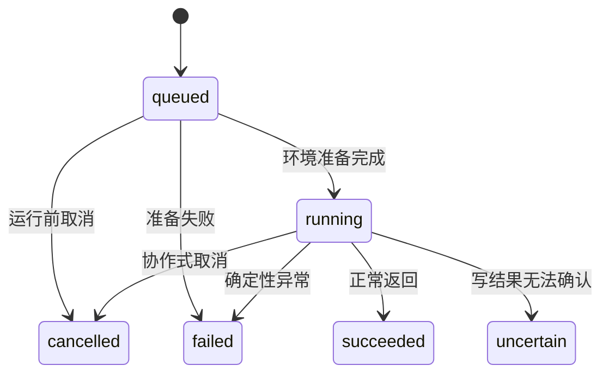
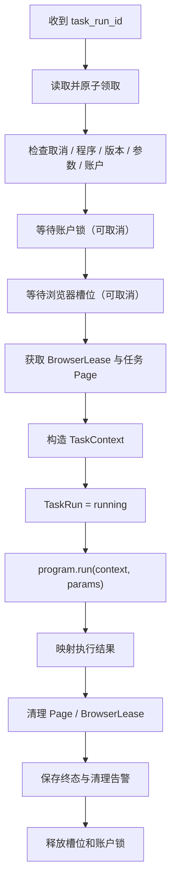

# Task Runner 详细处理流程设计

> 状态：设计已确认，作为 Task Runner 实现依据
> 日期：2026-08-20
> 关联文档：[脚本式任务系统架构](script-task-system-architecture.md) · [管理后台功能与组织设计](admin-console-design.md)

## 1. 定位与边界

Task Runner 是任务程序的通用运行容器：为一个 TaskRun 准备互斥、可取消、可观察且能可靠清理的环境，然后调用：

```python
output = await program.run(context, params)
```

Runner 负责：

- 读取并原子领取 TaskRun；
- 查找程序、校验版本和参数；
- 读取账户并取得账户锁、浏览器任务槽位；
- 通过 `browser-custom` 获取 BrowserLease 和任务 Page；
- 构造绑定当前 Page 的 XActions 与五项 TaskContext 能力；
- 映射成功、失败、不确定和取消结果；
- 保存结果并释放全部资源。

Runner 不决定时间线、匹配规则、动作选择与顺序、循环次数、回复内容或业务额度，也不实现 StepRun、Checkpoint 和整个任务的自动重放。

## 2. 输入与依赖

Runner 只接收 `task_run_id`，以数据库中的不可变快照为执行事实来源：

```python
await runner.execute(task_run_id)
```

```python
@dataclass(frozen=True)
class TaskRunSnapshot:
    id: str
    task_id: str | None
    trigger_id: str | None
    program_name: str
    requested_program_version: str | None
    account_id: str
    params: dict[str, object]
    status: str
    cancel_requested_at: datetime | None
    deadline: datetime | None
    browser_end_policy: str
    created_at: datetime
```

一个调用永远只执行一个账户的一个 TaskRun。

建议依赖：

| 依赖 | 用途 |
|---|---|
| `TaskRunStore` | 领取、状态更新、结果保存 |
| `AccountStore` | 读取可运行账户 |
| `TaskProgramRegistry` | 查找已部署程序 |
| `AccountLockManager` | 同账户互斥 |
| `ExecutionSlotManager` | 限制浏览器任务并发 |
| `BrowserGateway` | 获取 BrowserLease/Page |
| `BoundXActionsFactory` | 将 XActions 绑定当前 Page |
| `AIService` | 注入 AI 能力 |
| `TaskLoggerFactory` | 创建生命周期和业务日志器 |
| `CancellationTokenFactory` | 创建协作式取消 Token |

这些依赖都是运行环境组件，不包含业务匹配或互动策略。

## 3. 状态模型

```text
queued
running
succeeded
failed
uncertain
cancelled
```

| 状态 | 含义 |
|---|---|
| `queued` | 等待领取、账户锁或并发槽位 |
| `running` | 环境已准备，任务程序正在执行 |
| `succeeded` | 程序正常返回 |
| `failed` | 确定性错误 |
| `uncertain` | 写动作已触发，但最终结果无法确认 |
| `cancelled` | 程序观察到取消并协作式退出 |

终态不可重新执行。重新运行必须创建新的 TaskRun，并用 `rerun_of` 关联。领取、启动和清理等内部阶段写结构化日志，不增加顶层状态。



## 4. 完整处理顺序



固定顺序：

1. 读取 TaskRun；
2. 原子领取 `queued` 运行；
3. 检查运行前取消；
4. 查找程序，校验实际版本和 Params；
5. 读取并校验账户；
6. 获取账户锁，再获取浏览器任务槽位；
7. 获取 BrowserLease 和 TaskRun 专用 Page；
8. 构造 TaskContext，最后检查取消；
9. 原子更新为 `running`；
10. 调用程序并映射结果；
11. 清理资源、保存终态；
12. 释放槽位和账户锁。

资源始终按获取顺序的反方向释放。

## 5. 领取与准备

### 5.1 原子领取

不存在的 TaskRun 只写系统日志 `RUN_NOT_FOUND`。非 `queued` 状态或领取失败的重复消息直接忽略。

```sql
UPDATE task_runs
SET claimed_by = :runner_id,
    claimed_at = :now
WHERE id = :run_id
  AND status = 'queued'
  AND claimed_by IS NULL;
```

只有更新一行的 Runner 可以继续。`claimed_by`/`claimed_at` 是内部并发字段；多机部署时再扩展为可过期租约。

### 5.2 程序和参数

```python
program = program_registry.get(run.program_name)
params = program.Params.model_validate(run.params)
actual_version = program.SPEC.version
```

- 找不到程序：`PROGRAM_NOT_FOUND`；
- 固定版本与部署版本不符：`PROGRAM_VERSION_UNAVAILABLE`；
- 参数校验失败：`INVALID_TASK_PARAMS`；
- 未固定版本时保存实际执行版本。

Runner 不解释 `feed`、`keywords`、`reply_mode` 等业务字段。

### 5.3 账户

运行前校验：账户存在、未禁用、允许参与任务、已绑定 `browser-custom` 账户。典型错误：

```text
ACCOUNT_NOT_FOUND
ACCOUNT_DISABLED
BROWSER_ACCOUNT_NOT_BOUND
```

传入 TaskContext 的是只读、已脱敏快照。

## 6. 账户锁与并发槽位

同一账户同一时间只能有一个 TaskRun；不同账户可以并行。资源获取顺序固定为：

```text
账户锁 → 浏览器任务并发槽位 → BrowserLease
```

先锁账户，避免忙碌账户占用稀缺槽位。每个 TaskRun 只锁一个账户，因此不存在多账户锁循环等待。

槽位表示“同时使用浏览器执行任务的 TaskRun 数量”。手动打开但未执行任务的浏览器不占 Runner 槽位；如需限制全部浏览器实例，应由 `browser-custom` 提供统一容量控制。

等待锁或槽位时 TaskRun 保持 `queued`，且必须响应取消。资源获取与取消同时发生时：

1. 同时监听资源与取消；
2. 取消先到则停止等待；
3. 若资源刚好已取得，立即释放；
4. 标记 `cancelled`，不得泄漏锁或槽位。

## 7. BrowserLease 与 Page

Runner 通过集成接口获取浏览器环境，不构造 CloakBrowser 启动参数：

```python
lease = await browser_gateway.acquire(
    browser_account_id=account.browser_account_id,
    task_run_id=run.id,
)
```

```python
@dataclass
class BrowserLease:
    account_id: str
    context: BrowserContext
    page: Page
    browser_was_started: bool

    async def release(self, *, close_browser: bool) -> CleanupReport:
        ...
```

建议每个 TaskRun 在账户 persistent context 中使用独立任务 Page：共享 Cookie/登录状态，但不抢占用户标签页；结束时只清理自己创建的页面和弹出页。

Playwright `Page` 不能通过 JSON HTTP 传递。第一版让 Runner、Session Registry 和 Playwright 位于同一 Python Worker；拆进程时使用明确的浏览器连接协议。

只有程序尚未开始、没有执行业务动作时，浏览器启动或 Page 创建才可做有限技术重试。建议最多重试一次；程序开始后不得自动重启浏览器并从头重放。

## 8. 构造 TaskContext 与进入 running

```python
context = TaskContext(
    account=AccountContext.from_account(account),
    actions=actions_factory.bind(lease.page),
    ai=ai_service.for_run(run.id, account.id),
    logger=logger_factory.create_task_logger(run, program, account),
    cancellation=cancellation_factory.create(run.id, run.deadline),
)
```

只有程序、参数、账户、锁、槽位、Session、Page 和 Context 全部准备完成，并通过最后一次取消检查后，才更新：

```text
queued → running
```

若 `mark_running()` 条件更新失败，不调用程序，直接清理已取得资源。浏览器准备失败允许 `queued → failed`。

## 9. 程序结果映射

```python
try:
    output = await program.run(context, params)
except TaskCancelledError as exc:
    outcome = RunOutcome.cancelled(exc)
except TaskUncertainError as exc:
    outcome = RunOutcome.uncertain(exc)
except Exception as exc:
    outcome = RunOutcome.failed(exc)
else:
    outcome = RunOutcome.succeeded(output)
```

- 正常输出必须可序列化为 JSON；
- 单个 ActionResult 的处理策略属于任务程序；
- 若原子动作返回 `uncertain`，任务程序应选择继续并记录，或抛出 `TaskUncertainError` 传播顶层不确定状态；
- 未处理异常映射为 `failed`；
- 程序已正常返回时，即使取消请求同时到达，也以 `succeeded` 为准。

## 10. 协作式取消与超时

`queued` 可直接取消；`running` 只写入 `cancel_requested_at`，由程序在安全检查点退出。

检查点包括：等待锁/槽位、环境准备后、循环开始、原子动作之间、AI 调用前、长等待和任务阶段之间。

不应在点赞、回复、Quote 或发帖已提交但尚未确认结果时硬切断。当前动作完成确认后，再抛出 `TaskCancelledError`。

```python
await context.cancellation.raise_if_cancelled()
await context.cancellation.sleep(60)  # 不使用不可取消的长 asyncio.sleep
```

超时分层处理：

- Locator、导航和动作超时由 `x-actions-playwright` 分类；
- 任务总时限通过 CancellationToken 的 deadline 在动作边界检查，映射 `TASK_TIMEOUT`；
- 浏览器获取、Page 创建和清理可使用硬超时；
- 不使用 `asyncio.wait_for(program.run(...))` 在任意时刻强切写动作。

## 11. 浏览器手动关闭

- 运行前已关闭：`browser-custom` 可正常重新启动；
- 运行中关闭：动作层返回浏览器关闭错误，Runner 通常标记 `failed`，不自动重跑；
- 若关闭发生在写动作已触发、结果尚未确认时，应传播 `uncertain`。

典型错误：`BROWSER_CLOSED_DURING_RUN`。

## 12. 错误映射与脱敏

| 阶段 | 示例 | 状态 |
|---|---|---|
| 重复领取 | 已被其他 Runner 领取 | 忽略 |
| 运行前取消 | `cancel_requested_at` | `cancelled` |
| 程序/版本/参数 | `PROGRAM_NOT_FOUND` 等 | `failed` |
| 账户/绑定 | `ACCOUNT_DISABLED` 等 | `failed` |
| 浏览器/Page | `BROWSER_START_FAILED` 等 | `failed` |
| 协作式取消 | `TaskCancelledError` | `cancelled` |
| 总时限 | `TaskTimeoutError` | `failed` |
| 写结果不确定 | `TaskUncertainError` | `uncertain` |
| 浏览器中途关闭 | `BROWSER_CLOSED_DURING_RUN` | `failed` 或 `uncertain` |
| 未知异常 | `UNHANDLED_TASK_ERROR` | `failed` |

错误建议结构：

```json
{
  "code": "BROWSER_START_FAILED",
  "message": "无法启动账户浏览器",
  "source": "browser-custom",
  "retryable": true,
  "details": {},
  "exception_type": "RuntimeError"
}
```

`retryable` 只表示新建 TaskRun 后技术上可能成功，不表示 Runner 自动重跑。日志和错误不得记录代理密码、API Key、Cookie、完整认证 Header/Token；敏感参数需脱敏，长文本需截断。

## 13. 清理与最终保存

浏览器结束策略只有：

- `keep_open`：关闭任务 Page，保留 persistent context；
- `close`：清理任务 Page，并由 `browser-custom` 关闭账户浏览器。

清理必须幂等，只处理本 TaskRun 拥有的资源。页面已关闭、Lease 已释放或浏览器已停止不应产生新的业务失败。

清理错误不覆盖主结果：任务已成功但关闭浏览器失败时，仍保存 `succeeded`，并附加 `cleanup_warnings`；任务已失败时保留原始错误。

Runner 在仍持有账户锁时条件更新终态，随后释放槽位和锁：

```sql
UPDATE task_runs
SET status = :status,
    output_json = :output,
    error_json = :error,
    finished_at = :finished_at
WHERE id = :run_id
  AND status = 'running'
  AND claimed_by = :runner_id;
```

数据库保存可有限重试，但不得因此再次调用任务程序。

## 14. Runner Service 与多账户

内部可区分：

```text
Runner Service：发现 queued TaskRun，启动 execute(run_id)
TaskRunner.execute：处理单个账户的一次运行
```

为避免一个忙账户造成队首阻塞，Runner Service 可创建有限数量的等待协程；建议上限为浏览器并发数的 2～4 倍。

多账户任务在创建阶段拆分：

```text
一次触发
├── account-001 → TaskRun-001
├── account-002 → TaskRun-002
└── account-003 → TaskRun-003
```

每个账户拥有独立状态、日志、输出、错误和取消，不在一个 Runner 调用中管理多个 Page。

## 15. 可观察性与异常退出

推荐生命周期事件：

```text
run_claimed, program_resolved, params_validated
account_lock_waiting/acquired
execution_slot_waiting/acquired
browser_acquire_started/acquired
task_page_created, context_created, program_started/finished
cleanup_started/finished, run_finished
```

公共字段包括 TaskRun、Task、trigger、程序与版本、账户、Runner、时间和级别。日志不形成 StepRun 数据模型。

Runner 进程异常退出后，遗留 `running` TaskRun 不自动重放；启动恢复逻辑将其标记为 `failed`/`RUNNER_INTERRUPTED`，提示管理员部分动作可能已完成。需要重跑时创建新 TaskRun。

## 16. 幂等、测试与首版顺序

防止重复执行依赖原子领取、`claimed_by`、条件状态更新和终态不可重入。具体点赞/关注等动作的幂等由 `x-actions-playwright` 负责。

重点测试：

- 两个 Runner 只能有一个领取成功，重复消息不重复执行；
- 程序、版本、参数或账户失败时不启动浏览器；
- 同账户互斥、不同账户并行、槽位上限准确；
- 等待资源时可取消且没有泄漏；
- 每个 TaskRun 使用独立 Page，清理不影响用户页面；
- `keep_open`/`close` 语义正确；
- 四种执行结果映射正确，成功后的取消竞态仍为成功；
- 任一注入失败点都释放锁、槽位、Page、Lease、取消监听器和日志缓冲；
- 清理异常不覆盖原结果，所有输出和错误正确脱敏。

第一版实现顺序：

1. TaskRunStore、六种状态和原子领取；
2. 程序注册表、版本与 Params 校验；
3. 单进程账户锁和浏览器任务槽位；
4. BrowserGateway、BrowserLease、独立任务 Page；
5. BoundXActions 与 TaskContext；
6. 程序调用、结果映射和协作式取消；
7. 清理策略、结构化日志和 Runner Service；
8. 启动时处理中断的 `running` TaskRun。

首版保持单机、单 Runner Service、多个异步 TaskRun；确有需要时再增加分布式锁、续期租约和跨节点浏览器调度。
