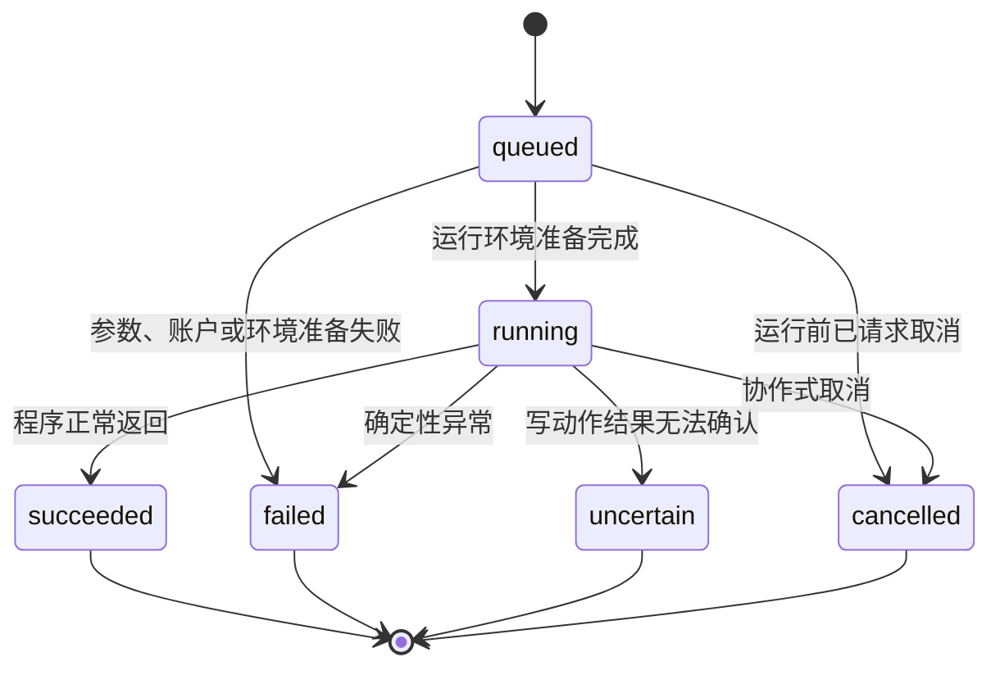
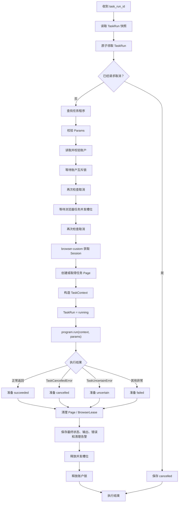
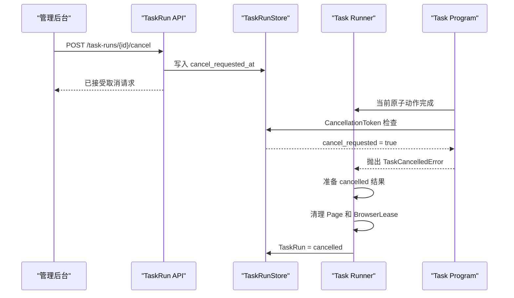

# Task Runner 详细处理流程设计

> 状态：设计已确认，作为 Task Runner 后续实现依据
> 日期：2026-08-20
> 关联文档：[脚本式任务系统架构](script-task-system-architecture.md)
> 关联文档：[管理后台功能与组织设计](admin-console-design.md)

## 1. 定位

Task Runner 是任务程序的通用运行容器。

它只解决一个问题：

> 如何为一个 TaskRun 准备正确、互斥、可取消、可观察并且能够可靠清理的运行环境，然后调用对应的任务程序。

Task Runner 最核心的调用只有：

```python
output = await program.run(context, params)
```

其中：

- `program` 是已经部署的任务程序；
- `params` 是经过该程序 `Params` 模型校验的参数快照；
- `context` 是 Task SDK 提供的五项公共能力。

Task Runner 不理解浏览、匹配、点赞、回复、关注等业务含义。

## 2. 职责边界

### 2.1 Task Runner 负责

- 领取一个等待执行的 TaskRun；
- 防止同一个 TaskRun 被重复执行；
- 查找任务程序；
- 校验任务程序参数；
- 读取当前账户；
- 检查运行前取消请求；
- 获取同账户互斥锁；
- 获取浏览器任务并发槽位；
- 通过 `browser-custom` 获取或启动账户浏览器；
- 获取本次运行使用的 Playwright `Page`；
- 创建绑定当前 Page 的 XActions；
- 创建 AI、日志、取消 Token 和 `TaskContext`；
- 把 TaskRun 从 `queued` 更新为 `running`；
- 调用任务程序；
- 捕获顶层成功、失败、不确定和取消结果；
- 清理 Page、浏览器租约和运行资源；
- 保存 TaskRun 最终状态、输出和错误；
- 释放浏览器并发槽位和账户锁。

### 2.2 Task Runner 不负责

- 决定浏览 For You 还是 Following；
- 判断帖子是否匹配目标作者、Twitter ID 或关键词；
- 决定是否点赞、回复、引用或关注；
- 决定动作执行顺序；
- 决定循环和滚动次数；
- 生成业务回复内容；
- 给点赞、回复等操作增加额度；
- 把任务拆分成工作流节点；
- 保存 StepRun 或 Checkpoint；
- 自动改写任务程序参数；
- 对整个任务进行盲目自动重试；
- 在浏览器意外关闭后自动重放已经执行过的业务动作。

## 3. Task Runner 的输入

### 3.1 推荐入口

推荐让 Runner 接收 `task_run_id`，再从数据库读取不可变运行快照：

```python
await runner.execute(task_run_id)
```

而不是让队列重复携带完整任务参数：

```python
await runner.execute(
    RunRequest(
        task_run_id="run-001",
        program_name="browse_only",
        account_id="account-001",
        params={...},
    )
)
```

以数据库中的 TaskRun 为执行事实来源，可以避免队列消息和数据库内容不一致。

### 3.2 TaskRun 执行快照

Runner 至少需要读取：

```python
@dataclass(frozen=True)
class TaskRunSnapshot:
    id: str
    task_id: str | None
    trigger_id: str | None

    program_name: str
    requested_program_version: str | None
    account_id: str
    params: dict[str, object]

    status: str
    cancel_requested_at: datetime | None
    deadline: datetime | None
    browser_end_policy: str

    created_at: datetime
```

其中：

- `params` 是创建 TaskRun 时保存的参数快照；
- `account_id` 只对应一个账户；
- `browser_end_policy` 决定任务完成后是否关闭账户浏览器；
- `trigger_id` 只用于把一次多账户触发产生的运行分组展示。

一个 TaskRunner 调用永远只执行一个账户的一个 TaskRun。

## 4. Task Runner 的依赖

建议通过构造函数注入以下依赖：

```python
class TaskRunner:
    def __init__(
        self,
        run_store: TaskRunStore,
        account_store: AccountStore,
        program_registry: TaskProgramRegistry,
        account_locks: AccountLockManager,
        execution_slots: ExecutionSlotManager,
        browser_gateway: BrowserGateway,
        actions_factory: BoundXActionsFactory,
        ai_service: AIService,
        logger_factory: TaskLoggerFactory,
        cancellation_factory: CancellationTokenFactory,
    ) -> None:
        ...
```

依赖作用：

| 依赖 | 作用 |
|---|---|
| `TaskRunStore` | 领取 TaskRun、更新状态、保存结果 |
| `AccountStore` | 读取当前账户业务信息 |
| `TaskProgramRegistry` | 根据名称查找任务程序 |
| `AccountLockManager` | 保证同账户只运行一个任务 |
| `ExecutionSlotManager` | 限制同时运行的浏览器任务数量 |
| `BrowserGateway` | 调用 `browser-custom` 获取 Session 和 Page |
| `BoundXActionsFactory` | 将当前 Page 绑定为 XActions |
| `AIService` | 注入 Task SDK 的 AI 接口 |
| `TaskLoggerFactory` | 创建自动关联 TaskRun 的日志器 |
| `CancellationTokenFactory` | 创建数据库支持的协作式取消 Token |

这些依赖都是运行环境组件，不包含帖子匹配或互动业务。

## 5. 顶层状态

TaskRun 只使用六种状态：

```text
queued
running
succeeded
failed
uncertain
cancelled
```

状态含义：

| 状态 | 含义 |
|---|---|
| `queued` | 已创建，等待 Runner、账户锁或并发槽位 |
| `running` | 运行环境已经准备完成，任务程序正在执行 |
| `succeeded` | 任务程序正常返回 |
| `failed` | 发生确定性错误，任务未正常完成 |
| `uncertain` | 写动作已经触发，但最终状态无法确认 |
| `cancelled` | 响应取消请求后结束，未继续执行后续动作 |

不增加 `starting`、`stopping`、`step_running` 等顶层状态。

任务领取、等待锁、启动浏览器等内部阶段通过结构化日志展示，不扩展 TaskRun 状态机。

## 6. 状态转换



终态不可再次执行：

```text
succeeded
failed
uncertain
cancelled
```

需要重新执行时，创建一个新的 TaskRun，并通过 `rerun_of` 关联旧运行。

## 7. 总体处理流程



## 8. 阶段一：读取和领取 TaskRun

### 8.1 读取

Runner 收到 `task_run_id` 后读取 TaskRun。

如果不存在：

```text
RUN_NOT_FOUND
```

此时没有可更新的 TaskRun，只写系统日志并结束。

### 8.2 检查状态

只有 `queued` 状态可以开始执行。

如果已经是终态：

```text
忽略本次重复消息
```

如果已经是 `running`：

```text
认为另一个 Runner 已经领取，忽略本次消息
```

Runner 不能因为收到重复队列消息就再次运行同一个任务。

### 8.3 原子领取

即使第一版只有一个 Runner 进程，也建议使用原子领取：

```sql
UPDATE task_runs
SET claimed_by = :runner_id,
    claimed_at = :now
WHERE id = :run_id
  AND status = 'queued'
  AND claimed_by IS NULL;
```

只有成功更新一行的 Runner 可以继续。

`claimed_by` 是内部并发字段，不增加新的管理后台状态。

第一版可增加：

```text
claimed_by
claimed_at
```

多 Runner 或跨机器执行时再增加可过期租约；当前不需要先实现复杂分布式 Lease 系统。

### 8.4 运行前取消

领取后立即检查：

```python
if run.cancel_requested_at is not None:
    await run_store.finish_cancelled(run.id)
    return
```

此时没有获取账户锁，也没有启动浏览器。

## 9. 阶段二：解析任务程序和参数

### 9.1 查找程序

```python
program = program_registry.get(run.program_name)
```

找不到时：

```text
status = failed
code = PROGRAM_NOT_FOUND
```

不启动浏览器。

### 9.2 记录实际程序版本

TaskRun 应保存真正执行的程序版本：

```python
actual_program_version = program.SPEC.version
```

如果 TaskRun 明确固定了 `requested_program_version`，但当前部署版本不匹配：

```text
status = failed
code = PROGRAM_VERSION_UNAVAILABLE
```

如果没有固定版本，则使用执行时当前部署版本，并将其保存到 TaskRun。

历史记录保存的是实际执行版本，不是任务配置页面后来显示的版本。

### 9.3 参数校验

```python
params = program.Params.model_validate(run.params)
```

失败时：

```text
status = failed
code = INVALID_TASK_PARAMS
```

错误中保存字段路径和校验消息，但不要保存 API Key、代理密码等敏感内容。

Task Runner 只调用模型校验，不解释 `feed`、`keywords`、`reply_mode` 等业务字段。

## 10. 阶段三：读取和校验账户

```python
account = await account_store.get(run.account_id)
```

校验：

- 账户存在；
- 账户没有被归档或删除；
- 账户允许参与任务；
- 账户关联的 browser-custom 账户 ID 存在。

错误示例：

```text
ACCOUNT_NOT_FOUND
ACCOUNT_DISABLED
BROWSER_ACCOUNT_NOT_BOUND
```

这些错误发生在获取账户锁和启动浏览器之前。

提供给 Task SDK 的账户对象是只读快照：

```python
account_context = AccountContext(
    account_id=account.id,
    name=account.name,
    username=account.username,
    tags=tuple(account.tags),
    metadata=MappingProxyType(dict(account.metadata)),
)
```

## 11. 阶段四：获取账户互斥锁

### 11.1 作用

同一个账户同一时间只能有一个 TaskRun 操作：

```text
account-001 → TaskRun-A 正在运行
account-001 → TaskRun-B 保持 queued
account-002 → TaskRun-C 可以并行
```

账户锁避免：

- 两个任务同时切换一个账户的页面；
- 一个任务正在输入，另一个任务点击其他位置；
- 两个任务同时回复同一帖子；
- 一个任务关闭弹窗，另一个任务正在使用弹窗；
- 两个任务共享同一个 Page 导致状态无法判断。

### 11.2 固定获取顺序

Runner 的资源获取顺序固定为：

```text
账户锁
  → 浏览器任务并发槽位
  → BrowserLease
```

先获取账户锁，再获取并发槽位，可以避免一个账户已经忙时仍占用稀缺的运行槽位。

每个 TaskRun 只获取一个账户锁，因此不会产生多账户锁循环等待。

### 11.3 等待期间取消

等待账户锁时 TaskRun 仍然是 `queued`。

等待必须能够响应取消：

```python
account_lock = await cancellation.wait_for(
    account_locks.acquire(account.id)
)
```

如果等待期间管理员取消：

```text
queued → cancelled
```

不启动浏览器，也不继续等待锁。

获取锁成功后再次调用：

```python
await cancellation.raise_if_cancelled()
```

避免取消请求和锁获取同时发生时继续启动浏览器。

### 11.4 获取资源与取消同时发生

取消感知的等待必须处理竞态：取消请求到达的同一时刻，账户锁或并发槽位也可能刚好获取成功。

实现规则：

1. 同时等待资源获取和取消信号；
2. 如果取消先完成，取消并等待资源获取协程退出；
3. 如果资源已经获取，再发现取消，则立即释放刚获取的资源；
4. 最终把 TaskRun 标记为 `cancelled`；
5. 不允许因为竞态泄漏账户锁或并发槽位。

`CancellationToken.wait_for()` 是 Runner 内部辅助能力，不增加 Task SDK 向任务程序暴露的第六项能力。

## 12. 阶段五：获取浏览器任务并发槽位

### 12.1 作用

并发槽位限制同时运行的浏览器任务数量，例如：

```text
MAX_CONCURRENT_BROWSER_TASKS = 10
```

有 50 个账户任务时：

- 最多 10 个 TaskRun 进入浏览器运行阶段；
- 其余 TaskRun 保持 `queued`；
- 前面的运行结束并释放槽位后，后面的继续。

这属于机器资源保护，不是业务操作额度。

### 12.2 槽位语义

Runner 的槽位准确含义是：

> 允许同时使用浏览器执行任务的 TaskRun 数量。

无论账户浏览器之前是否已经打开，只要 TaskRun 要开始操作浏览器，就需要占用一个槽位。

管理员在 `browser-custom` 页面手动打开、但没有运行任务的浏览器，不占用 Runner 任务槽位。实际浏览器总数仍可由
`browser-custom` 状态页面单独观察。

如果未来需要严格限制包括手动浏览器在内的全部浏览器实例，应在 `browser-custom` 增加统一容量控制，
而不是让 Task Runner 猜测浏览器进程数量。

### 12.3 等待期间取消

与账户锁相同，等待并发槽位期间仍是 `queued`，并且必须响应取消。

获得槽位后再次检查取消，避免不必要地启动浏览器。

## 13. 阶段六：获取 BrowserLease

### 13.1 BrowserGateway

Task Runner 不直接调用 CloakBrowser 启动参数，而是通过集成接口：

```python
lease = await browser_gateway.acquire(
    browser_account_id=account.browser_account_id,
    task_run_id=run.id,
)
```

`BrowserGateway` 内部调用 `browser-custom` 的 Session Registry。

`browser-custom` 负责：

- 判断账户浏览器是否已经运行；
- 未运行时启动 persistent context；
- 使用正确的 `userDataDir`；
- 处理代理、GeoIP、时区、语言、WebRTC 和指纹；
- 加载全局插件；
- 返回可用的 BrowserContext 和 Page；
- 识别浏览器被用户手动关闭的情况。

Task Runner 不构造 CloakBrowser 启动参数。

### 13.2 BrowserLease

建议使用明确的租约对象：

```python
@dataclass
class BrowserLease:
    account_id: str
    context: BrowserContext
    page: Page
    browser_was_started: bool

    async def release(self, *, close_browser: bool) -> CleanupReport:
        ...
```

租约表示本次 TaskRun 对账户浏览器的临时使用权，不表示任务程序拥有整个浏览器生命周期。

### 13.3 Page 策略

推荐为每个 TaskRun 创建一个独立的任务 Page：

```text
同一个 persistent context
    ├── 用户手动打开的页面
    └── TaskRun 专用 Page
```

优点：

- 不直接抢占用户当前正在看的标签页；
- TaskRun 开始页面状态更可控；
- TaskRun 结束后可以关闭自己创建的页面；
- 不同 TaskRun 不会不断复用残留的页面导航状态。

账户登录状态、Cookie、Local Storage 等仍然由同一个 persistent context 共享，因此任务 Page 保持账户登录状态。

BrowserLease 应记录本次运行创建的 Page 和弹出页，并只清理自己拥有的页面。

### 13.4 Page 不能通过普通 HTTP 返回

Playwright `Page` 是进程内对象，不能序列化为 JSON。

第一版推荐：

```text
Task Runner
browser-custom Session Registry
Playwright
```

运行在同一个 Python Worker 进程，通过内部 Python 接口获取 Page。

如果未来拆分进程，需要使用明确的 Playwright 浏览器连接协议，不能把 Page 放入 HTTP 响应。

### 13.5 环境准备重试

只有在任务程序尚未开始、没有执行任何业务动作时，浏览器启动或 Page 创建才可以进行有限技术重试。

推荐第一版：

```text
环境准备最多重试 1 次
任务程序开始后不自动重启浏览器并重跑程序
```

这样可以处理一次性的浏览器启动错误，又不会重复已经执行的点赞或回复。

## 14. 阶段七：构造 TaskContext

### 14.1 绑定 XActions

```python
actions = actions_factory.bind(lease.page)
```

任务程序使用：

```python
await context.actions.timeline.collect(...)
await context.actions.interaction.like(...)
await context.actions.publish.reply(...)
```

任务程序不需要每次传入 Page，也不能切换到其他账户 Page。

如果 `x-actions-playwright` 当前接口要求每个方法传入 Page，`BoundXActionsFactory` 使用薄包装器自动补入。

### 14.2 创建任务日志器

```python
logger = logger_factory.create(
    task_run_id=run.id,
    task_id=run.task_id,
    program_name=program.SPEC.name,
    program_version=program.SPEC.version,
    account_id=account.id,
)
```

任务程序写日志时不需要重复传公共字段。

### 14.3 创建协作式取消 Token

```python
cancellation = cancellation_factory.create(
    task_run_id=run.id,
    deadline=run.deadline,
)
```

它提供：

```python
await cancellation.raise_if_cancelled()
await cancellation.sleep(seconds)
```

取消 Token 可以通过短周期读取 TaskRun 的 `cancel_requested_at`，也可以结合进程内事件加速本机取消响应。

### 14.4 AI 服务

AI Service 可以按 TaskRun 包装日志和超时信息：

```python
ai = ai_service.for_run(
    task_run_id=run.id,
    account_id=account.id,
)
```

Task Runner 只注入服务，不决定是否调用 AI。

### 14.5 最终 TaskContext

```python
context = TaskContext(
    account=account_context,
    actions=actions,
    ai=ai,
    logger=logger,
    cancellation=cancellation,
)
```

Task SDK 对任务程序仍然只暴露五项能力。

## 15. 阶段八：进入 running

在以下条件全部满足后，TaskRun 才从 `queued` 进入 `running`：

- 程序存在；
- 参数校验通过；
- 账户有效；
- 已取得账户锁；
- 已取得并发槽位；
- 浏览器 Session 可用；
- Task Page 可用；
- TaskContext 已构造；
- 最后一次取消检查通过。

原子更新：

```python
started = await run_store.mark_running(
    run_id=run.id,
    runner_id=runner_id,
    program_version=program.SPEC.version,
    started_at=clock.now(),
)
```

如果更新失败，说明 TaskRun 状态已经被其他操作改变。Runner 不调用任务程序，直接进入资源清理。

浏览器启动失败时允许：

```text
queued → failed
```

不要求必须先进入 `running`。

## 16. 阶段九：调用任务程序

```python
output = await program.run(context, params)
```

### 16.1 正常返回

任务程序正常返回：

```text
准备状态：succeeded
```

输出必须可以保存为 JSON：

```python
output_json = serialize_program_output(output)
```

推荐任务程序返回简单字典：

```json
{
  "posts_seen": 52,
  "matched": 4,
  "liked": 3,
  "replied": 1
}
```

### 16.2 协作式取消

任务程序在动作边界执行：

```python
await context.cancellation.raise_if_cancelled()
```

收到取消后抛出：

```python
TaskCancelledError
```

Runner 映射为：

```text
running → cancelled
```

### 16.3 结果不确定

`x-actions-playwright` 的原子动作可能返回 `uncertain`。

Task Runner 无法观察任务程序内部每一个 ActionResult，因此任务程序必须明确传播顶层不确定结果：

```python
result = await context.actions.publish.reply(...)

if result.status == "uncertain":
    raise TaskUncertainError(
        action_id=result.action_id,
        details=result.to_dict(),
    )
```

Runner 映射为：

```text
running → uncertain
```

如果任务程序根据自身业务选择继续执行，它可以把不确定动作计入最终输出；Runner 不替任务程序做决定。

### 16.4 确定性失败

未被任务程序处理的异常由 Runner 捕获：

```text
running → failed
```

Runner 保存结构化错误，但不自动重新运行整个任务。

### 16.5 取消与成功同时发生

取消是一个请求，不是对已经完成结果的强制覆盖。

如果任务程序已经正常返回，然后管理员刚好请求取消：

```text
succeeded 优先
```

只有任务程序实际观察到取消并抛出 `TaskCancelledError`，TaskRun 才标记为 `cancelled`。

这样可以避免一个已经完成的任务因为取消竞态被错误标记为取消。

## 17. 协作式取消详细流程



取消检查位置：

- 等待账户锁期间；
- 获得账户锁后；
- 等待并发槽位期间；
- 获得并发槽位后；
- 浏览器环境准备完成后；
- 任务程序循环开始处；
- 每个原子动作之前；
- AI 调用之前；
- 长时间等待期间；
- 任务阶段之间。

不建议在以下阶段强制中断：

- 点赞按钮已经点击，正在确认最终状态；
- 回复已经提交，正在判断是否发布成功；
- Quote 或发帖已经提交，正在等待帖子出现。

当前动作完成确认后，在下一个取消检查点结束。

### 17.1 可取消 sleep

任务程序不得使用不可响应取消的长时间：

```python
await asyncio.sleep(60)
```

应使用：

```python
await context.cancellation.sleep(60)
```

实现可以同时等待计时器和取消事件：

```python
async def sleep(self, seconds: float) -> None:
    cancelled = await self.wait_cancelled(timeout=seconds)
    if cancelled:
        raise TaskCancelledError(self.task_run_id)
```

### 17.2 队列取消

如果 TaskRun 仍为 `queued`，API 可以直接完成取消：

```text
queued → cancelled
```

Runner 后续收到旧队列消息时发现 TaskRun 已经是终态，直接忽略。

## 18. 超时处理

### 18.1 原子动作超时

页面点击、等待、导航等动作超时由 `x-actions-playwright` 处理和分类。

Task Runner 不替原子动作实现 Locator 超时。

### 18.2 任务总时限

如果配置了任务总时限，推荐把 deadline 注入 CancellationToken，在动作边界协作式检查：

```python
if clock.now() >= self.deadline:
    raise TaskTimeoutError(...)
```

Runner 映射为：

```text
status = failed
code = TASK_TIMEOUT
```

不要仅依靠 `asyncio.wait_for(program.run(...))` 在任意时刻硬切断任务，因为它可能正好中断一个尚未确认结果的写动作。

### 18.3 环境和清理超时

以下基础设施操作可以使用明确的硬超时：

- 获取或启动浏览器；
- 创建 Page；
- 关闭任务 Page；
- 关闭浏览器；
- 等待残留进程退出。

这些超时不代表自动重跑任务程序。

## 19. 浏览器被用户手动关闭

### 19.1 任务开始前关闭

如果浏览器在 Runner 获取环境前已经被用户关闭，`browser-custom` 可以正常重新启动它。

### 19.2 任务运行中关闭

如果用户在任务程序运行期间手动关闭浏览器：

1. Playwright Context 或 Page 触发关闭；
2. 当前 XActions 返回浏览器已关闭错误；
3. 异常传播到任务程序或 Runner；
4. TaskRun 标记为 `failed`；
5. Runner 执行资源清理；
6. `browser-custom` 状态刷新为 `stopped` 或按实际进程判断为 `orphaned`。

Runner 不自动重启浏览器并从头重跑任务，因为之前可能已经完成点赞或回复。

错误示例：

```text
code = BROWSER_CLOSED_DURING_RUN
```

如果关闭发生在写动作已经触发、但尚未确认结果时，`x-actions-playwright` 或任务程序应传播 `uncertain`，
而不是普通 `failed`。

## 20. 错误分类和状态映射

| 阶段 | 错误示例 | TaskRun 状态 |
|---|---|---|
| 领取 | 已被其他 Runner 领取 | 不更新，忽略消息 |
| 运行前 | 已请求取消 | `cancelled` |
| 程序解析 | `PROGRAM_NOT_FOUND` | `failed` |
| 程序版本 | `PROGRAM_VERSION_UNAVAILABLE` | `failed` |
| 参数校验 | `INVALID_TASK_PARAMS` | `failed` |
| 账户读取 | `ACCOUNT_NOT_FOUND` | `failed` |
| 账户校验 | `ACCOUNT_DISABLED` | `failed` |
| 浏览器绑定 | `BROWSER_ACCOUNT_NOT_BOUND` | `failed` |
| 浏览器启动 | `BROWSER_START_FAILED` | `failed` |
| Page 创建 | `PAGE_CREATE_FAILED` | `failed` |
| 协作式取消 | `TaskCancelledError` | `cancelled` |
| 总时限 | `TaskTimeoutError` | `failed` |
| 写动作不确定 | `TaskUncertainError` | `uncertain` |
| 浏览器中途关闭 | `BROWSER_CLOSED_DURING_RUN` | `failed` 或 `uncertain` |
| AI 服务 | `AI_TIMEOUT`、`AI_PROVIDER_ERROR` | 由任务程序处理；未处理则 `failed` |
| 未知异常 | `UNHANDLED_TASK_ERROR` | `failed` |

保存错误时建议结构：

```json
{
  "code": "BROWSER_START_FAILED",
  "message": "无法启动账户浏览器",
  "source": "browser-custom",
  "retryable": true,
  "details": {},
  "exception_type": "RuntimeError"
}
```

`retryable` 只表示技术上是否可能通过重新创建一个 TaskRun 再试，不代表 Runner 会自动重跑整个任务。

错误返回和日志必须脱敏：

- 不记录代理密码；
- 不记录 AI API Key；
- 不记录 Cookie；
- 不记录完整认证 Header；
- 必要时截断过长的页面内容和模型响应。

## 21. 阶段十：资源清理

资源必须按获取顺序的反方向释放：

```text
停止使用 TaskContext
  → 清理 TaskRun 自己创建的 Page
  → 释放 BrowserLease / 按策略关闭浏览器
  → 保存最终 TaskRun
  → 释放浏览器任务并发槽位
  → 释放账户锁
```

### 21.1 Page 清理

BrowserLease 只关闭本次 TaskRun 创建或拥有的页面，不关闭用户手动打开的其他页面。

如果任务 Page 已经被用户或页面导航关闭，清理应当幂等，不把“页面已经关闭”当成新的业务失败。

### 21.2 浏览器结束策略

当前只保留两种配置：

```text
keep_open
close
```

`keep_open`：

- 关闭 TaskRun 自己创建的任务 Page；
- 保持账户 persistent context 和浏览器运行；
- 适合连续执行多个任务，避免频繁启停。

`close`：

- 清理任务 Page；
- 调用 `browser-custom` 关闭该账户浏览器；
- 等待 persistent context 和残留进程退出。

如果账户浏览器在任务开始前已经由管理员打开，`close` 仍表示任务结束后关闭该账户浏览器。管理后台应明确展示这一语义。

### 21.3 清理错误

清理错误不覆盖已经确定的业务结果。

例如任务程序已经成功，但关闭浏览器失败：

```text
status = succeeded
cleanup_warnings = [BROWSER_CLOSE_FAILED]
```

原因是把它改成 `failed` 可能诱导管理员重新运行已经完成的点赞或回复。

如果任务本身已经失败：

```text
status = failed
primary_error = 原始任务错误
cleanup_warnings = 清理错误
```

始终保留原始错误，不能让清理异常覆盖它。

### 21.4 清理幂等

以下操作必须可以安全重复调用：

- 关闭已经关闭的 Page；
- 释放已经释放的 BrowserLease；
- 释放任务自己的日志资源；
- 停止取消监听器；
- 关闭已经停止的账户浏览器。

## 22. 阶段十一：保存最终结果

Runner 在仍持有账户锁时保存最终状态，避免下一个同账户任务已经开始，而前一个运行仍显示 `running`。

```python
await run_store.finish(
    run_id=run.id,
    status=outcome.status,
    output=outcome.output,
    error=outcome.error,
    cleanup_warnings=cleanup_report.warnings,
    finished_at=clock.now(),
)
```

终态更新应使用条件更新：

```sql
UPDATE task_runs
SET status = :status,
    output_json = :output,
    error_json = :error,
    finished_at = :finished_at
WHERE id = :run_id
  AND status = 'running'
  AND claimed_by = :runner_id;
```

对于环境准备阶段失败，允许从 `queued` 直接更新到 `failed` 或 `cancelled`。

数据库更新可以进行有限基础设施重试，但不能因此重新调用任务程序。

## 23. 释放槽位和账户锁

最终结果保存后：

1. 释放浏览器任务并发槽位；
2. 释放账户互斥锁；
3. 通知 Runner Service 本次执行结束。

释放顺序不能提前：

- BrowserLease 没有清理前不能释放账户锁；
- TaskRun 最终状态没有尽力保存前不能让下一个同账户任务开始；
- 所有异常路径都必须经过 `finally`。

## 24. Task Runner 伪代码

```python
class TaskRunner:
    async def execute(self, task_run_id: str) -> None:
        run = await self.run_store.get(task_run_id)
        if run is None:
            self.system_logger.error("TaskRun 不存在", task_run_id=task_run_id)
            return

        if run.status != "queued":
            return

        if not await self.run_store.claim(run.id, self.runner_id):
            return

        lifecycle_logger = self.logger_factory.create_lifecycle_logger(run)

        if await self.run_store.is_cancel_requested(run.id):
            await self.run_store.finish_cancelled_before_start(run.id)
            return

        try:
            program = self.program_registry.get(run.program_name)
            params = program.Params.model_validate(run.params)
            account = await self.account_store.require_runnable(run.account_id)
        except Exception as exc:
            await self.finish_preparation_failure(run, exc)
            return

        cancellation = self.cancellation_factory.create(run.id)

        try:
            account_lock = await cancellation.wait_for(
                self.account_locks.acquire(account.id)
            )
        except TaskCancelledError:
            await self.run_store.finish_cancelled_before_start(run.id)
            return

        async with account_lock:
            try:
                await cancellation.raise_if_cancelled()
                execution_slot = await cancellation.wait_for(
                    self.execution_slots.acquire()
                )
            except TaskCancelledError:
                await self.run_store.finish_cancelled_before_start(run.id)
                return

            async with execution_slot:
                lease = None
                cleanup_report = CleanupReport()
                outcome = None

                try:
                    await cancellation.raise_if_cancelled()

                    lease = await self.browser_gateway.acquire(
                        browser_account_id=account.browser_account_id,
                        task_run_id=run.id,
                    )

                    actions = self.actions_factory.bind(lease.page)
                    task_logger = self.logger_factory.create_task_logger(
                        run=run,
                        program=program,
                        account=account,
                    )

                    context = TaskContext(
                        account=AccountContext.from_account(account),
                        actions=actions,
                        ai=self.ai_service.for_run(run.id, account.id),
                        logger=task_logger,
                        cancellation=cancellation,
                    )

                    await cancellation.raise_if_cancelled()

                    marked = await self.run_store.mark_running(
                        run_id=run.id,
                        runner_id=self.runner_id,
                        program_version=program.SPEC.version,
                    )
                    if not marked:
                        return

                    outcome = await self.invoke_program(
                        program=program,
                        context=context,
                        params=params,
                    )

                except TaskCancelledError as exc:
                    outcome = RunOutcome.cancelled(exc)
                except TaskUncertainError as exc:
                    outcome = RunOutcome.uncertain(exc)
                except Exception as exc:
                    outcome = RunOutcome.failed(exc)
                finally:
                    if lease is not None:
                        cleanup_report = await self.safe_cleanup_lease(
                            lease,
                            browser_end_policy=run.browser_end_policy,
                        )

                if outcome is not None:
                    await self.run_store.finish(
                        run_id=run.id,
                        runner_id=self.runner_id,
                        outcome=outcome,
                        cleanup_report=cleanup_report,
                    )
```

`safe_cleanup_lease()` 必须把清理异常转换为 `CleanupReport.warnings`，不能重新抛出并覆盖已经确定的
任务结果。`mark_running()` 失败时直接退出；`finally` 仍会清理 BrowserLease，但不会错误覆盖其他操作已经写入的状态。

程序调用单独封装：

```python
async def invoke_program(self, program, context, params) -> RunOutcome:
    try:
        output = await program.run(context, params)
    except TaskCancelledError as exc:
        return RunOutcome.cancelled(exc)
    except TaskUncertainError as exc:
        return RunOutcome.uncertain(exc)
    except Exception as exc:
        return RunOutcome.failed(exc)
    else:
        return RunOutcome.succeeded(output)
```

伪代码展示职责和顺序，不规定最终类名。

## 25. Runner Service 与单次 TaskRunner

可以在同一个 Runner 模块内区分两个内部角色：

```text
Runner Service
  负责发现 queued TaskRun，并启动 execute(run_id)

TaskRunner.execute
  负责一个账户的一次完整运行
```

这不是新的业务层，也不需要独立 Dispatcher 架构。

### 25.1 避免队首阻塞

如果 Runner Service 顺序等待每个账户锁：

```text
TaskRun-A 等待忙碌的 account-001
TaskRun-B 使用空闲 account-002
```

TaskRun-B 可能被 A 阻塞。

因此 Runner Service 可以为已领取运行创建轻量 asyncio Task，让各运行独立等待账户锁，真正进入浏览器阶段时再受
`ExecutionSlotManager` 限制。

必须限制同时存在的等待协程数量，避免队列极大时一次创建过多协程。

第一版可以使用：

```text
最大待执行协程数 = 浏览器并发数的 2～4 倍
```

该数值是基础设施配置，不是业务额度。

## 26. 多账户任务与 Runner 的关系

多账户拆分发生在创建 TaskRun 阶段，不发生在 TaskRunner 内部：

```text
Task：选择 3 个账户
    ↓
TaskRun-001：account-001
TaskRun-002：account-002
TaskRun-003：account-003
```

TaskRunner 分别执行三个 TaskRun。

优点：

- 每个账户独立取消；
- 每个账户独立日志；
- 每个账户独立成功或失败；
- 一个账户失败不影响其他账户；
- 账户锁语义简单；
- 不需要在一个 Runner 调用中管理多个 Page。

## 27. 日志和可观察性

Runner 应写结构化生命周期日志，任务程序使用同一个 TaskLogger 写业务日志。

推荐 Runner 事件：

```text
run_claimed
program_resolved
params_validated
account_lock_waiting
account_lock_acquired
execution_slot_waiting
execution_slot_acquired
browser_acquire_started
browser_acquired
task_page_created
context_created
program_started
cancel_requested
program_finished
cleanup_started
cleanup_finished
run_finished
```

公共字段：

```text
task_run_id
task_id
trigger_id
program_name
program_version
account_id
runner_id
timestamp
level
```

日志用于查看详细进展，但不形成 StepRun 数据模型。

## 28. Runner 进程异常退出

当前架构不支持从 Checkpoint 恢复任务程序。

Runner 重启后发现遗留 `running` TaskRun 时：

1. 不自动从头执行；
2. 不假设之前没有执行写动作；
3. 标记为 `failed`，错误代码为 `RUNNER_INTERRUPTED`；
4. 提示管理员检查日志和账户实际状态；
5. 需要重跑时创建新的 TaskRun。

错误中应明确：

```text
任务执行进程异常终止，部分业务动作可能已经完成，请检查后再决定是否重新运行。
```

未来如果确实需要更精确判断，可以根据结构化的 action started/completed 日志识别是否有未确认写动作，
但当前不增加 StepRun 或 Checkpoint 系统。

## 29. 幂等和重试原则

### 29.1 防止同一 TaskRun 重复执行

通过：

- 原子领取；
- `claimed_by`；
- 条件状态更新；
- 终态不可重新进入运行；

防止同一个 TaskRun 被重复执行。

### 29.2 不自动重跑整个任务

Task Runner 不对以下情况自动从头重跑：

- 浏览器在任务中途关闭；
- 任务程序异常；
- AI 调用失败；
- 写动作结果不确定；
- Runner 进程异常退出。

重新运行必须创建新的 TaskRun。

### 29.3 原子动作幂等

点赞动作检查已经点赞、关注动作检查已经关注等行为属于 `x-actions-playwright`。

Task Runner 不实现具体动作幂等。

## 30. 安全和脱敏

Task Runner 处理日志和错误时：

- 不把代理密码放入 TaskContext；
- 不记录 browser-custom 密钥；
- 不记录 AI API Key；
- 不记录完整 Cookie；
- 不记录完整认证 Token；
- 对帖子正文、AI 输入输出设置合理日志长度；
- `params` 中标记为 secret 的字段必须脱敏；
- 未知异常堆栈可以进入服务端日志，但管理后台只显示整理后的错误。

## 31. 测试范围

### 31.1 领取和状态测试

- 只有 `queued` 可以领取；
- 两个 Runner 只能有一个领取成功；
- 重复消息不会重复执行；
- 终态消息被忽略；
- 运行前取消直接进入 `cancelled`。

### 31.2 参数和账户测试

- 程序不存在；
- 固定版本不可用；
- 参数校验失败；
- 账户不存在；
- 账户被停用；
- browser-custom 账户未绑定；
- 这些错误都不启动浏览器。

### 31.3 并发测试

- 同账户不能同时运行两个 TaskRun；
- 不同账户可以并行；
- 并发槽位严格限制浏览器任务数量；
- 等待账户锁时可取消；
- 等待并发槽位时可取消；
- 所有退出路径释放锁和槽位。

### 31.4 浏览器环境测试

- 已运行浏览器可以取得任务 Page；
- 停止状态能够启动浏览器；
- 每个 TaskRun 使用独立任务 Page；
- 清理不关闭用户其他页面；
- `keep_open` 保持浏览器；
- `close` 关闭浏览器；
- 用户手动关闭后返回正确错误；
- 浏览器启动失败不会调用任务程序。

### 31.5 TaskContext 测试

- 当前账户信息只读；
- XActions 只绑定当前 Page；
- Logger 自动补充公共字段；
- AI Service 关联当前 TaskRun；
- CancellationToken 可以中断等待。

### 31.6 结果映射测试

- 正常返回 → `succeeded`；
- `TaskCancelledError` → `cancelled`；
- `TaskUncertainError` → `uncertain`；
- 普通异常 → `failed`；
- 成功返回后的取消竞态仍为 `succeeded`；
- 清理异常不覆盖原始结果；
- 输出和错误正确脱敏。

### 31.7 清理测试

对每个失败注入点验证：

- 参数失败；
- 账户锁后失败；
- 槽位获取后失败；
- 浏览器启动后失败；
- Page 创建后失败；
- Context 创建后失败；
- 程序运行中失败；
- 保存结果时失败。

确保不会泄漏：

- 账户锁；
- 执行槽位；
- 任务 Page；
- BrowserLease；
- 取消监听器；
- 日志缓冲。

## 32. 第一版实现顺序

推荐按以下顺序实现：

1. `TaskRunStore` 和六种状态转换；
2. 任务程序注册表和 Params 校验；
3. 单进程账户锁；
4. 单进程浏览器任务并发槽位；
5. `BrowserGateway` 和 `BrowserLease`；
6. `BoundXActionsFactory`；
7. TaskContext 五项能力组装；
8. 程序调用和错误映射；
9. 协作式取消；
10. 资源清理和结束策略；
11. 结构化生命周期日志；
12. Runner Service 队列循环；
13. 启动时处理中断的 `running` TaskRun。

第一版保持单机、单 Runner Service、多个异步 TaskRun。等真正需要多机器时，再增加分布式锁、可续期任务租约和
跨节点浏览器调度。

## 33. 最终处理顺序

```text
1. 读取 TaskRun
2. 原子领取 queued TaskRun
3. 检查运行前取消
4. 查找任务程序
5. 记录或校验程序版本
6. 使用程序 Params 校验参数快照
7. 读取并校验当前账户
8. 等待账户互斥锁，可取消
9. 再次检查取消
10. 等待浏览器任务并发槽位，可取消
11. 再次检查取消
12. 通过 browser-custom 获取 BrowserLease
13. 创建 TaskRun 专用 Page
14. 创建绑定 Page 的 XActions
15. 创建账户、AI、日志和 CancellationToken
16. 构造只有五项能力的 TaskContext
17. 最后一次检查取消
18. TaskRun 从 queued 更新为 running
19. 调用 program.run(context, params)
20. 将正常返回映射为 succeeded
21. 将协作式取消映射为 cancelled
22. 将不确定写结果映射为 uncertain
23. 将未处理异常映射为 failed
24. 清理任务 Page
25. 根据策略保持或关闭浏览器
26. 保存最终状态、输出、错误和清理告警
27. 释放浏览器任务并发槽位
28. 释放账户互斥锁
29. Runner 结束本次 TaskRun
```

这套流程保证 Task Runner 只处理运行环境和生命周期，不参与任务程序内部的 X/Twitter 业务逻辑。
