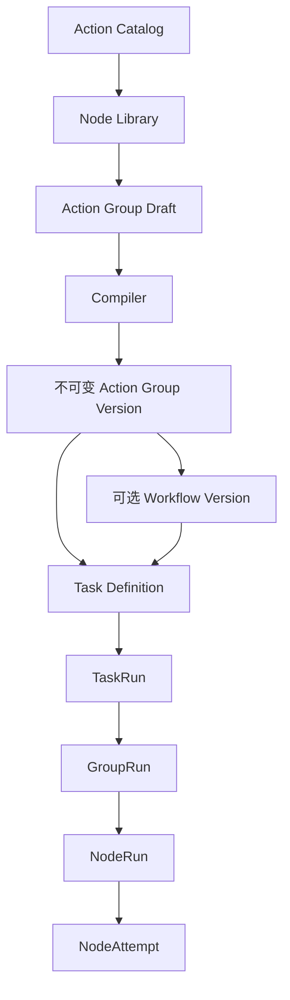
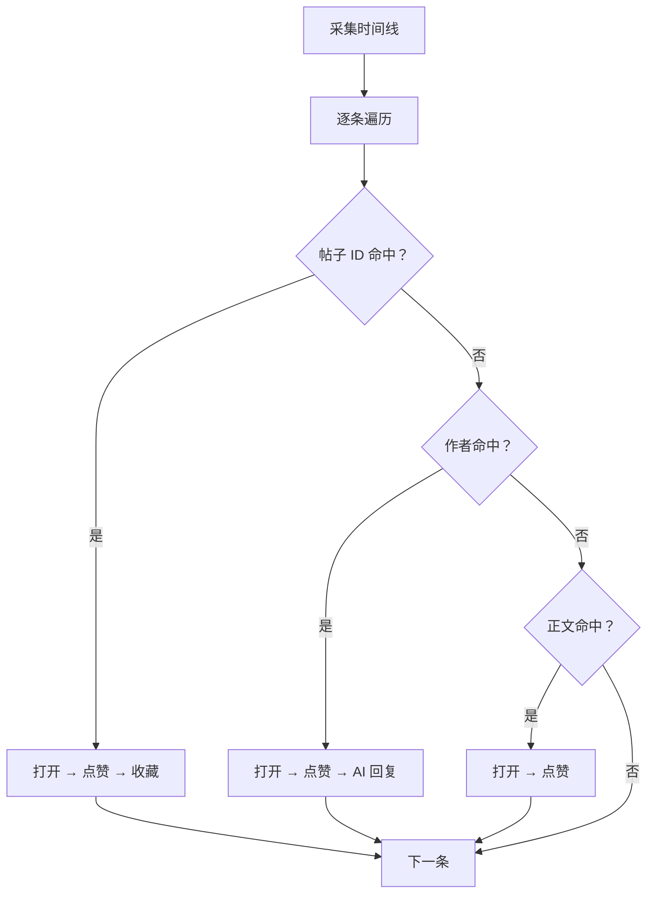
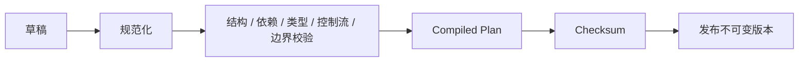

# 可视化工作流引擎设计（冻结）

> 状态：未来备选方案，当前不实现，也不是脚本式任务系统的运行依赖
> 日期：2026-08-20
> 当前方案：[脚本式任务系统架构](script-task-system-architecture.md)
> 目的：保留已经确认的工作流边界、数据模型和执行语义，供未来评估。

## 1. 定位与原则

若未来引入可视化工作流，它位于 `browser-custom` 和 `x-actions-playwright` 之上，让管理员组合原子动作、条件、循环、数据处理和 AI 节点，形成可版本化的动作组与工作流。

底层边界不变：

- `browser-custom` 只管理 CloakBrowser、Profile、网络身份、插件和浏览器生命周期；
- `x-actions-playwright` 只实现 X 页面识别、Locator、操作和后置状态验证；
- 工作流层负责编排、版本、运行状态和持久化。

设计原则：

- 管理员发布的编排按定义执行，不自动加入点赞/回复额度或强制审批；
- 人工审批只能作为管理员主动放置的可选节点；
- 保留输入输出校验、账户互斥、同 Page 顺序执行、有界循环、超时、不可变版本、运行快照和错误持久化；
- 写动作结果无法确认时返回 `uncertain`，不可安全重试的动作不盲目重试；
- 不允许管理员输入任意 Python、JavaScript、Shell 或 `eval`；新能力通过受审核节点类型扩展。

## 2. 分层模型



动作组被视为一个有公开契约的函数：

```text
ActionGroup(Input) -> Output
```

外部任务和工作流只能读取动作组声明的输出，不能依赖内部任意节点变量。一个任务选择多个账户时，仍为每个账户创建独立 TaskRun。

## 3. Action Catalog

`x-actions-playwright` 应提供机器可读的动作定义，供编译器和管理台生成节点/表单：

```python
class ActionDefinition(BaseModel):
    id: str
    version: str
    category: str
    title: str
    description: str
    input_schema: dict
    output_schema: dict
    access: Literal["read", "write"]
    retry_policy: Literal["safe", "never"]
    idempotent: bool
    enabled: bool
    timeout_default_ms: int
    timeout_max_ms: int
    requires_page_type: list[str]
    resulting_page_type: str | None
    statuses: list[str]
    failure_modes: list[FailureMode]
```

统一动作状态：

```text
success | skipped | navigating | uncertain | cancelled | failed
```

统一结果至少包含 `status`、`action`、`data`、`evidence`、`warnings` 和包含耗时/读写属性/重试语义的 `meta`。每个动作必须声明输入输出 Schema；写动作已提交但无法确认时返回 `uncertain`，并保留目标和原因等证据。

## 4. 节点与表达式

首批节点类型：

| 节点 | 用途 |
|---|---|
| `ActionNode` | 调用一个原子动作 |
| `ConditionNode` / `SwitchNode` | 二元或多分支控制 |
| `ForEachNode` | 有界顺序遍历，必须设置 `maxItems` |
| `MatchRuleNode` | 按作者、帖子、正文、语言、媒体或指标匹配 |
| `WaitNode` | 有限等待 |
| `SetVariableNode` | 设置常量或保存输出 |
| `TransformNode` | 受控的 filter/map/unique/slice/sort/pick/merge |
| `AIGenerateNode` | 生成文本并返回模型元数据 |
| `OptionalApprovalNode` | 可选人工审批 |
| `GroupReferenceNode` | 引用已发布动作组的明确版本 |
| `OutputNode` | 声明公开输出 |

匹配表达式支持 `all`、`any`、`not` 组合，常用操作符包括字符串相等/包含/前后缀/安全正则、列表包含、数字比较/区间、布尔和存在性。正则必须在发布前校验并限制执行时间。

匹配模式：

- `first_match`：按优先级执行第一个命中分支；
- `all_matches`：执行全部命中分支。

`MatchRuleNode` 输出 `matched`、`route` 和 `matchedRules`，便于解释分支原因。

## 5. 输入、变量与图

动作组输入输出使用 JSON Schema 或等价类型系统。运行时作用域：

```text
task
account
group.input
group.vars
nodes
loop
```

绑定示例：

```json
{
  "source": "node_output",
  "nodeId": "collect_timeline",
  "path": "data.posts"
}
```

管理台应提供变量选择器，避免管理员手写复杂路径。

底层编排使用 `nodes + edges` 有向图，边从结果端口连接下一节点。第一版不支持自由回边；循环只通过 `ForEachNode` 表达。同一账户、同一 Page 的浏览器动作严格顺序执行。

典型编排：



针对虚拟列表，应先采集并保存 `postId/postUrl`，再过滤、打开详情并执行写动作。

## 6. 编译与发布



发布校验至少包括：

- 节点 ID 唯一，边引用有效，入口/输出存在，无悬空和不可达节点；
- 无普通回边，`ForEach` 有界，动作组引用不递归且嵌套深度有限；
- action ID 存在、启用且依赖固定到明确版本；
- 必填输入、固定值和 Binding 符合 Schema；上下游类型兼容；
- Condition/Switch 分支完整，节点最终可到达 Output；
- Wait、节点和动作有超时，同 Page 动作不并行；
- `failed` 与 `uncertain` 有默认语义。

编译不会检查业务操作额度，也不会自动插入审批。

Compiled Plan 保存动作组版本、Catalog/动作库版本与 Hash、规范化图、解析后的依赖、输入输出 Schema、错误策略、编译器版本和 Checksum。运行只执行 Plan，不执行可变草稿。

## 7. 执行与错误策略

执行主链路：

1. Worker 领取 TaskRun；
2. 获取账户锁、浏览器槽位和 Page；
3. 创建 GroupRun，按 Compiled Plan 执行 ready 节点；
4. 节点执行前保存输入与 `running`；
5. 调用原子动作或节点执行器；
6. 保存输出、错误、证据、截图和耗时；
7. 按结果端口选择后继；
8. 保存公开输出并释放资源。

允许的错误策略：

```text
retry | continue | goto | skip | stop | fail | cancel | fallback_group
```

`retry` 仅适用于 Catalog 标记为 `retry_policy=safe` 的动作。`uncertain` 可配置停止、继续、进入验证节点或把任务标记为部分完成，但不能当普通失败盲目重试。

`navigating` 且 `requiresRetry=true` 时，可保存第一次结果、等待页面稳定后有限次重新执行当前节点；这属于导航阶段，不是通用错误重试。

## 8. 持久化与版本

主要实体：

```text
action_catalog_snapshots
action_groups / action_group_drafts / action_group_versions
workflows / workflow_drafts / workflow_versions
task_definitions / task_runs
group_runs / node_runs / node_attempts / loop_iteration_runs
run_events / artifacts
```

关键规则：

- Catalog Snapshot 保存动作库版本、Hash 和完整定义；
- Draft 可修改并保存最近校验结果；
- 发布版本保存不可变图、Plan、编译器、Catalog Snapshot 和 Checksum；
- TaskRun 保存绑定版本、Plan、输入/账户快照、当前位置、状态与结果摘要；
- NodeRun/Attempt 保存解析输入、输出、错误、循环路径、次数、截图、Trace 和耗时。

版本生命周期：

```text
draft → validated → published → deprecated → archived
```

发布版本不可原地修改；修改需从某版本创建新草稿。任务和 GroupReference 固定明确版本。Deprecated 不再推荐给新任务，Archived 仍保留历史引用；回滚只切换推荐版本指针。

## 9. 恢复与重跑

恢复原则：

- 未开始节点可直接执行；
- 已成功节点复用持久化输出；
- 安全读动作按策略重试；
- 写动作中断且结果不可靠时标记 `uncertain`；
- 已成功 AI 节点默认复用原输出；
- `ForEach` 从未完成迭代恢复。

TaskRun 应保存 Plan、版本、输入/账户快照、AI 模型与提示词版本、节点输入输出和必要的截图/Trace。外部 X 页面状态无法保证完全重现，但执行配置必须可追溯。

重跑永远创建新 TaskRun，可选择完整重跑、从失败节点创建新运行、复用或重新生成 AI 输出，并明确提示会再次执行哪些写动作。历史运行不可被重跑操作修改。

## 10. 管理台

未来管理台可包含：

- Action Catalog：分类、Schema、读写属性、状态、错误、超时和重试语义；
- 动作组编辑器：节点库、画布、配置面板和编译结果；
- 匹配规则编辑器：字段、操作符、值、优先级和匹配模式；
- 编译面板：错误/警告、节点/分支/循环、读写动作摘要、依赖与版本；
- 版本页：草稿、发布历史、Diff、依赖、Deprecated 和推荐版本；
- TaskRun 详情：节点状态、输入输出、错误、尝试、截图、Trace、循环索引和耗时。

写动作摘要用于知情展示，不阻止管理员发布。

## 11. 启动条件与未来顺序

当前阶段继续使用脚本式任务系统，不实施本方案。重新评估工作流引擎前至少应满足：

- `x-actions-playwright` 的动作目录、输入输出、错误和幂等契约稳定；
- 已出现多个任务程序共享复杂编排、且脚本维护成本明显高于工作流引擎成本；
- 确实需要非开发者组合任务、节点级恢复或版本化动作组。

若启动，建议顺序：

1. 固化 Action Catalog Snapshot；
2. 实现 Draft/Version 数据模型；
3. 先实现编译器，不做可视化界面；
4. 实现最小执行引擎和 NodeRun 持久化；
5. 用 JSON 动作组跑通端到端；
6. 再开发可视化编辑器；
7. 最后增加 Workflow 组合、AI 节点和高级重现。

这份文档只保留未来方案的关键约束，不应被当前代码当作实现要求。
